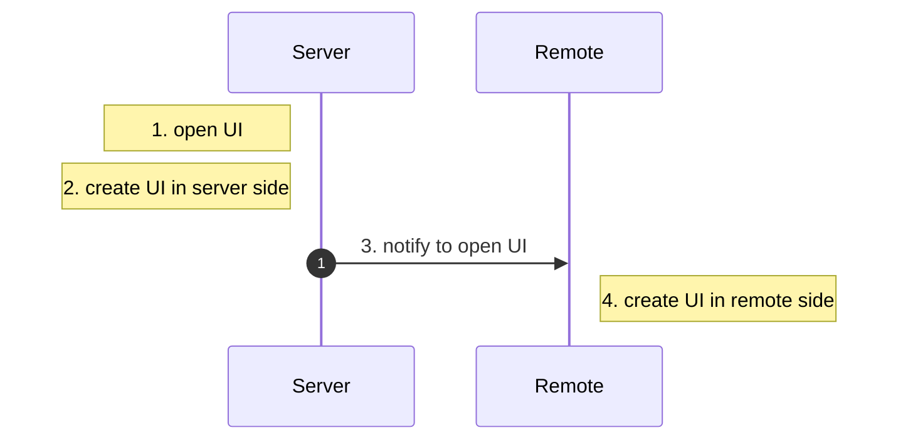

# Get Started

Creating UI using `Java` and `KubeJS` is mostly the same. This page will introduce the basic workflow of creating and using a UI.  

The entire **UI creation and usage pipeline** consists of the following steps:

1. Create UI widget and layout (1)
    { .annotate }

    1.  :material-hexagon-multiple: Create `buttons` and `item slots`, set their positions...

2. Bind UI functional logic (1)
    { .annotate }

    1.  :material-hexagon-multiple: Add logic to be executed when a `button` is clicked, bind `inventory` to `item slots`...

3. Display the UI (1)
    { .annotate }

    1.  :material-hexagon-multiple: Open the `GUI` when `right-clicking` an item, open the `GUI` when `right-clicking` a block...

Technically, the `UI function binding` and `UI widget creation` processes happen simultaneously, as many controls provide constructors that bind functions at the same time.  

On this page, we **separate step 1 and step 2** in the code examples to provide a clearer understanding of how the `UI` works.

---

## Create `UI` Widgets and Layout
    
Let's begin with a [`WigetGroup`](../widget/WidgetGroup.md), which is a container of child widgtes. Therefore, we create a `WidgetGroup` as a root widget. Check all widgets [`here`](../widget/index.md).

Then, we add a `Label` and a `Button` into it.

=== "Java"

    ``` java 
    public WidgetGroup createUI() {
        // create a root container
        var root = new WidgetGroup();
        root.setSize(100, 100);
        root.setBackground(ResourceBorderTexture.BORDERED_BACKGROUND);

        // create a label and a button
        var label = new LabelWidget();
        label.setSelfPosition(20, 20);
        label.setText("Hello, World!");
        var button = new ButtonWidget();
        button.setSelfPosition(20, 60);
        button.setSize(60, 20);
        // prepare button textures
        var backgroundImage = ResourceBorderTexture.BUTTON_COMMON;
        var hoverImage = backgroundImage.copy().setColor(ColorPattern.CYAN.color);
        var textAbove = new TextTexture("Click me!");
        button.setButtonTexture(backgroundImage, textAbove);
        button.setClickedTexture(hoverImage, textAbove);

        // add the label and button to the root container
        root.addWidgets(label, button);
        return root;
    }
    ```

=== "KubeJS"

    ``` javascript
    function createUI() {
        // create a root container
        let root = new WidgetGroup();
        root.setSize(100, 100);
        root.setBackground(ResourceBorderTexture.BORDERED_BACKGROUND);

        // create a label and a button
        let label = new LabelWidget();
        label.setSelfPosition(20, 20);
        label.setText("Hello, World!");
        let button = new ButtonWidget();
        button.setSelfPosition(20, 60);
        button.setSize(60, 20);
        // prepare button textures
        let backgroundImage = ResourceBorderTexture.BUTTON_COMMON;
        let hoverImage = backgroundImage.copy().setColor(ColorPattern.CYAN.color);
        let textAbove = new TextTexture("Click me!");
        button.setButtonTexture(backgroundImage, textAbove);
        button.setClickedTexture(hoverImage, textAbove);

        // add the label and button to the root container
        root.addWidgets(label, button);
        return root;
    }
    ```

<div style="text-align: center;">
  <video width="640" height="360" controls>
    <source src="../assets/root.mp4" type="video/mp4">
    Your browser does not support video.
  </video>
</div>

 <!-- { width="80%" style="display: block; margin: 0 auto;" } -->

---


## Bind UI functional logic

After the creation of the ui, we should implement the logic of the ui. For example, we want to **click the button to change the label text**.


=== "Java"

    ``` java 
    public WidgetGroup createUI() {
        // creation of the ui
        // ....

        // click logic
        AtomicInteger counter = new AtomicInteger(0);
        button.setOnPressCallback(clickData -> {
            label.setText("Clicked " + counter.incrementAndGet() + " times!");
        });

        return root;
    }
    ```

=== "KubeJS"

    ``` javascript
    function createUI() {
        // creation of the ui
        // ....

        // click logic
        let counter = 0;
        button.setOnPressCallback(clickData => {
            counter++;
            label.setText("Clicked " + counter + " times!");
        });

        return root;
    }
    ```

<div style="text-align: center;">
  <video width="640" height="360" controls>
    <source src="../assets/counter.mp4" type="video/mp4">
    Your browser does not support video.
  </video>
</div>

---

## Display the UI

Now, let's display the ui we create! We need to specify a `UI Factory` to display the ui, which maintains the lifecycle of the ui. 

There are four steps:

1. `open ui`
2. `create UI in server side`
3. `notify to open UI`
4. `create UI in remote side`



`UI Factory` will help handle the `step 3`. Therefore, user should define **WHEN** to trigger `step 1`, and **WHAT** to be createed in `step 2` and `step 4`. In general, the UI created on the server side and the remote side is the same in most cases.

LDLib provides two built-in factories:

1. Block Entity UI Factory
2. Held Item UI Factory

### Block Entity UI Factory

This factory allows user to open the ui from a block.

#### Java

1. Java user should implement [`IUIHolder.Block`](https://github.com/Low-Drag-MC/LDLib-MultiLoader/blob/1.20.1/common/src/main/java/com/lowdragmc/lowdraglib/gui/modular/IUIHolder.java) for your own `BlockEntity` and implement the method `createUI(Player entityPlayer)`.

2. Call the method `BlockEntityUIFactory.INSTANCE.openUI()` when you want to open the ui.

#### KubeJS

KubeJS user can do the same thing in an easy way. User can even open the ui for the block (without entity), but less accessibility compared with Java.

1. KubeJS user should use `LDLibUI.block(ui_name, e => {})` to create the ui by the given `ui_name`.
2. Call the method `BlockUIFactory.INSTANCE.openUI(player, pos, ui_name)` when you want to open the ui.

=== "Java"

    ``` java 
    public class TestBlockEntity extends BlockEntity implements IUIHolder {
        
        public void onPlayerUse(Player player) {
            // step 1 here.
            if (player instanceof ServerPlayer serverPlayer) {
                BlockEntityUIFactory.INSTANCE.openUI(this, serverPlayer);
            }
        }

        private WidgetGroup createUI() {
            // ....
        }

        @Override
        public ModularUI createUI(Player entityPlayer) {
            // step 2 and step 4 here 
            return new ModularUI(createUI(), this, entityPlayer);
        }
    }
    ```

=== "KubeJS"

    ``` javascript
    // server script

    BlockEvents.rightClicked('test_block_ui', event => { 
        // step 1 here.
        BlockUIFactory.INSTANCE.openUI(event.player, event.block.pos);
    })

    function createUI() {
        // ....
    }

    LDLibUI.block("test_block_ui", e => { 
        // step 2 and step 4 here 

        // let level = e.level
        // let pos = e.pos
        // let block = e.block
        // let player = e.player

        var ui = createUI();
        e.success(ui);
    })
    ```

### Held Item UI Factory

This factory allows user to open the ui from the held item.

#### Java

1. Java user should implement [`IUIHolder.Item`](https://github.com/Low-Drag-MC/LDLib-MultiLoader/blob/1.20.1/common/src/main/java/com/lowdragmc/lowdraglib/gui/modular/IUIHolder.java) for your own `Item` and implement the method `createUI(Player entityPlayer, HeldItemUIFactory.HeldItemHolder holder)`.

2. Call the method `HeldItemUIFactory.INSTANCE.openUI()` when you want to open the ui.

#### KubeJS

KubeJS user can do the same thing in an easy way. User can even open the ui for the block (without entity), but less accessibility compared with Java.

1. KubeJS user should use `LDLibUI.item(ui_name, e => {})` to create the ui by the given `ui_name`.
2. Call the method `ItemUIFactory.INSTANCE.openUI(player, hand, ui_name)` when you want to open the ui.

=== "Java"

    ``` java 
    public class TestItem implements IUIHolder.Item {
        @Override
        public InteractionResult useOn(UseOnContext context) {
            // step 1 here.
            if (context.getPlayer() instanceof ServerPlayer serverPlayer) {
                HeldItemUIFactory.INSTANCE.openUI(serverPlayer, context.getHand());
            }
            return InteractionResult.SUCCESS;
        }

        private WidgetGroup createUI() {
            // ....
        }

        @Override
        public ModularUI createUI(Player entityPlayer, HeldItemUIFactory.HeldItemHolder holder) {
            // step 2 and step 4
            return new ModularUI(createUI(), holder, entityPlayer);
        }
    }
    ```

=== "KubeJS"

    ``` javascript
    // server script

    ItemEvents.firstRightClicked('minecraft:stick', event => {
        // step 1 here.
        ItemUIFactory.INSTANCE.openUI(event.player, event.hand, "test_item_ui");
    })

    function createUI() {
        // ....
    }

    LDLibUI.item("test_item_ui", e => {
        // step 2 and step 4

        // let player = e.player
        // let hand = e.hand
        // let held = e.held

        var ui = createUI();
        e.success(ui);
    })
    ```
<div style="text-align: center;">
  <video width="640" height="360" controls>
    <source src="../assets/display.mp4" type="video/mp4">
    Your browser does not support video.
  </video>
</div>