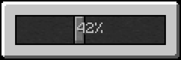

# SliderWidget
Added v1.0.48
<br>

Widget from SliderWidget test.<br>
{ width="30%" align=right }


The `SliderWidget` is a simple gui slider, like in the Minecraft option menus. It features Horizontal and Vertical modes, and can have any number of steps.

---

## Features

- **Orientation mode** – Horizontal or Vertical modes.
- **Event handling** – Fires callbacks when the slider moves.
- **Step Size** - How many steps the slider has. 0 = the length of the slider, adding more than the length allows sub gui-pixel slider.

---

## Properties

| Field          | Type           | Description                                                                                                            |
|----------------|----------------|:-----------------------------------------------------------------------------------------------------------------------|
| `sliderValue`  | `Float`        | The position value of the slider, 0 - 1.                                                                               |
| `valueStep`    | `Integer`      | Number of steps the slider has. 0 = the length of the slider, adding more than the length allows sub gui-pixel slider. |
| `leftUpKey`    | `Char/Integer` | Integer representation of the key used to move the slider in the left or up direction, depending on mode.              |
| `rightDownKey` | `Char/Integer` | Same as above but for right and down                                                                                   |
| `handleSize`   | `Integer`      | Size of handle in pixels.                                                                                              |
| `minAmount`    | `Float`        | Min amount of slider, used for code only.                                                                              |
| `minAmount`    | `Float`        | Same as above but max.                                                                                                 |

---

## APIs

### setSliderCallback

Setting the change callback.<br>
Example sets text overlay to display value in percentage.

=== "Java"

    ```Java
    sliderWidget.setSliderCallback(value -> {
        if(sliderWidget.getOverlay() instanceof TextTexture) {
            ((TextTexture) sliderWidget.getOverlay()).updateText(((int) (value * 100)) + "%%");
        }
    });
    ```

=== "KubeJS"

    ```Javascript
    sliderWidget.setSliderCallback(value => {
        if(sliderWidget.getOverlay() typeof TextTexture) {
            ((TextTexture) sliderWidget.getOverlay()).updateText(((int) (value * 100)) + "%%");
        }
    });
    ```

### getAmount

Returns float of the lerp from minAmount to maxAmount.<br>
Example, `minAmount = 5`, `maxAmount = 10`, `sliderValue = 0.5f`, then .getAmount() returns `0.75f`


=== "Java"

    ```Java
    value = sliderWidget.getAmount();
    ```

=== "KubeJS"

    ```Javascript
    value = sliderWidget.getAmount();
    ```

---

### setAmount

Sets the sliderValue to the inverseLerp using minAmount and maxAmount<br>
Example, `minAmount = 5`, `maxAmount = 10`, `sliderValue = 0.5f`, then .getAmount() returns `0.75f`


=== "Java"

    ```Java
    sliderWidget.setAmount(0.5f);
    ```

=== "KubeJS"

    ```Javascript
    sliderWidget.setAmount(0.5f);
    ```

---