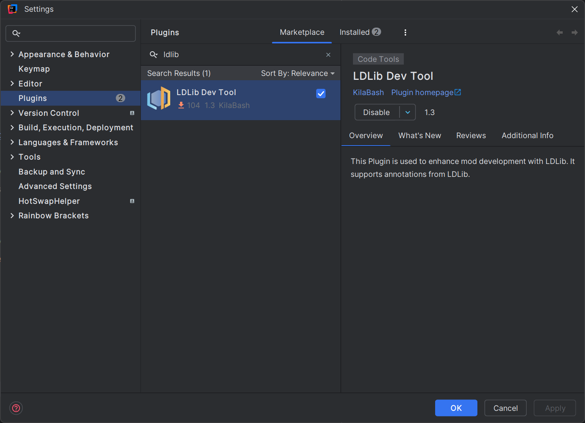
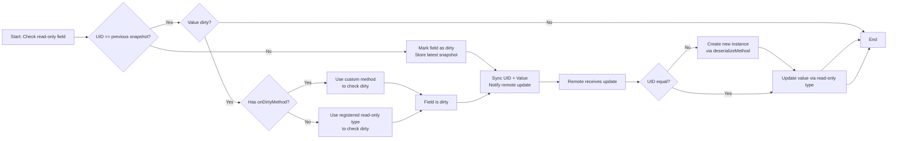

# Anotations
{{ version_badge("2.1.0", label="Since", icon="tag") }}

We show all anotations and their usage in this page.

!!! note "LDLib Dev Tool"
    { width="60%" align=right}

    If you are going to develop with LDLib2, we strongly recommend you to install our IDEA Plugin [LDLib Dev Tool](https://plugins.jetbrains.com/plugin/28032-ldlib-dev-tool). 
    The plugin has:

    - code highlight
    - syntax check
    - cdoe jumping
    - auto complete
    - others
    
    which greatly assist you in utilizing features of LDLib2. Especially, all the annotations of LDLib2 have been supported for use.

## Common Annotations

### `@DescSynced`
Annotate a field, the value of this field (server side) should be synced to the client side (specifically, `remote`)

``` java
@DescSynced
int a;

@DescSynced
private ItemStack b = ItemStack.EMPTY;

@DescSynced
private List<ResourceLocation> c = new ArrayList<>();
```

---

### `@Persisted`
Annotate a field, the value of this field (server side) will be written/read to/from BlockEntities' nbt. 

`String key()` represent tag name in nbt. default -- use field name instead.

``` java
@Persisted(key = "fluidAmount")
int value = 100;
@Persisted
boolean isWater = true;
```

its nbt/json looks as below:
```json
{
  "fluidAmount": 100,
  "isWater": true
}
```

`boolean subPersisted()` If true, it will wrap the field's internal value based on its `non-null` instance.

It is very useful for `final` instance which doesn't allow new instance creation. If the filed set `subPersisted = true`, LDLib2 will do:

- if the field inherits from `INBTSerializable<?>`, it will try to use its api for serialization.
- otherwise, it will serialize the field's internal values and wrap it as a map.

```java
@Persisted(subPersisted = true) // @Persisted is also fine here, because INBTSerializable is also supported as a read-only field.
private final INBTSerializable<CompoundTag> stackHandler = new ItemStackHandler(5);
@Persisted(subPersisted = true)
private final TestContainer testContainer = new TestContainer();

public static class TestContainer {
    @Persisted
    private Vector3f vector3fValue = new Vector3f(0, 0, 0);
    @Persisted
    private int[] intArray = new int[]{1, 2, 3};
}
```

its nbt/json looks as below:
```json
{
    "stackHandler": {
        "Size": 5,
        "Items": [],
    },
    "testContainer": {
        "vector3fValue": [0, 0, 0],
        "intArray": [1, 2, 3],
    }
}
```

---

### `@LazyManaged`
 An annotation that marks a field as being managed lazily. This means that the field will only be marked as dirty manually.automatically.
 This annotation is useful for fields that are not updated frequently, or for fields that are updated in a batch.

``` java
@DescSynced
@Persisted
int a;

@DescSynced 
@Persisted
@LayzManaged
int b;

public void setA(int value) {
    this.a = value;  // will be sync/persist automatically, in general
}

public void setB(int value) {
    this.b = value;
    markDirty("b"); // mannually notify chagned
}
```

---

### `@ReadOnlyManaged`
This annotation is used to mark a read-only field that is managed by the user. 

`read-only` types (e.g. `IManaged` and `INBTSerializable<?>`) requires the field to be non-null and the field instance won't be changed (a final field). 

!!! note "What are `read-only` types?"
    `read-only` types refer to fields which are always non-null and immutable, and not sure how to create a new instance of this type. More details can be found in [Types Support](./types.md){ data-preview }.

Because we don't know how to create a new instance for these types. In this case, you can use this annotation and provide methods to
store a unique id from server with `serializeMethod()` and create a new instance at the client with `deserializeMethod()`.
 
Furthermore, you can provide a method to self-control whether the field has changed with `onDirtyMethod()`.

- `onDirtyMethod`: specify a method for customize dirty checking. return whether it has changed.
    ```java
    boolean methodName();
    ```
- `serializeMethod`: return a unique id (`Tag`) of given instance.
    ```java
    Tag methodName(@Nonnull T obj);
    ```
- `deserializeMethod`: create an instance via given uid.
    ```java
    T methodName(@Nonnull Tag tag)
    ```

Synchronization Process (Persistence is similar)



1. To check if a `read-only` field has internal changes, LDLib2 will first check if unique id is equal to previous snapshot. 
    - If `not`, mark this field as dirty, and store the latest snapshot.
    - If `true`, go to step 2.
2. Check if the the value is dirty compared with previous snapshot.
    - if `onDirtyMethod` is not set, LDLib2 will check dirty according to the registered `read-only` type.
    - if `true`, use customized method to check if dirty.
3. If the field is dirty. LDLib2 will sync both uid and value data and ask remote (client) to update value.
4. While the remote receive the changes, it will check uid first. 
    - if not equal, create a new instance based on `deserializeMethod` first.
    - then update value based on registered `read-only` type.

Example

```java
@Persisted
@DescSync
@ReadOnlyManaged(serializeMethod = "testGroupSerialize", deserializeMethod = "testGroupDeserialize")
private final List<TestGroup> groupList = new ArrayList<>();

public static class TestGroup implements IPersistedSerializable {
    @Persisted
    private Range rangeValue = Range.of(0, 1);
    @Persisted
    private Direction enumValue = Direction.NORTH;
    @Persisted
    private Vector3i vector3iValue = new Vector3i(0, 0, 0);
}

public IntTag testGroupSerialize(List<TestGroup> groups) {
    return IntTag.valueOf(groups.size());
}

public List<TestGroup> testGroupDeserialize(IntTag tag) {
    var groups = new ArrayList<TestGroup>();
    for (int i = 0; i < tag.getAsInt(); i++) {
        groups.add(new TestGroup());
    }
    return groups;
}
```
!!! note
    In this example, `onDirtyMethod` is unncessary. Because `TestGroup` inherits from `IPersistedSerializable`, which also inherits from `INBTSerializable<?>`. Therefore, it is a supported `read-only` type.

---

### `@RPCMethod`
Annotate a method, you can send RPC packet between server and remote. You are free to define the parameters of the methods long as the parameters support sync, and send rpc anywhere in your class.
It is useful to spread an event (`c->s` / `s->c`).
!!! note
    if the `RPCSender` is defined as your first parameter of your method. LDLib2 will provide the sender information.

Make sure that all args match the parameters of annotated method.

```java
@RPCMethod
public void rpcTestA(RPCSender sender, String message) {
    if (sender.isServer()) {
        LDLib2.LOGGER.info("Received RPC from server: {}", message);
    } else {
        LDLib2.LOGGER.info("Received RPC from client: {}", message);
    }
}

@RPCMethod
public void rpcTestB(ItemStack item) {
    LDLib2.LOGGER.info("Received RPC: {}", item);
}

// methods to send rpc
public void sendMsgToPlayer(ServerPlayer player, String msg) {
    rpcToServer(player, "rpcTestA", msg)
}

public void sendMsgToAllTrackingPlayers(ServerPlayer player, String msg) {
    rpcToTracking("rpcTestA", msg)
}

public void sendMsgToServer(ItemStack item) {
    rpcToServer("rpcTestB", item)
}
```

* `rpcToTracking`: send to all remote players if this chunk is loaded(tracked) in their remotes.
* `rpcToPlayer`: send to a specfic player
* `rpcToServer`: send to server.

```java
@RPCMethod
public void rpcTest(String msg) {
    if (level.isClient) { // receive 
        LDLib2.LOGGER.info("Received RPC from server: {}", message);
    } else { // send
        rpcToTracking("rpcTest", msg)
    }
}
```
In this example, you can send and receive msg within one method, which is a neat method.

---

### `@UpdateListener`
Use this annotation to add a listener of sync receiving on the remote side.

Specifies the name of the method to be called (remote side) when the annotated field is updated from the server.

The first parameter is the old value, and the second parameter is the new value.

```java
@DescSynced
@UpdateListener(methodName = "onIntValueChanged")
private int intValue = 10;

private void onIntValueChanged(int oldValue, int newValue) {
    LDLib2.LOGGER.info("Int value changed from {} to {}", oldValue, newValue);
}
```

---

### `@SkipPersistedValue`
In general, all fields annotated with `@Persisted` will be serialized during persistence. 
However, you may want to skip serialization, e.g., reduce output size, skip unchanged value, etc.

LDLib2 provide this annotation allow you to fine-grained control whether the field should be serialized.

```java
@Persisted
int intField = 10;

@SkipPersistedValue(field = "intField")
public boolean skipIntFieldPersisted(int value) {
    // 10 is the initial value of this class, there is no need to store it.
    return value == 10;
}
```

---

## Exclusive to `BlockEntity`
!!! note
    These annotations are designed specially for `BlockEntity`, check [Manage BlockEntity](./blockentity.md){ data-preview } before using them.

### `@DropSaved`
Sometimes, you want to store the field values into the drop item while breaking the block.
This annotation is used to mark a field to be saved to the drop item. However, it also require additional code work before using it.
```java
public class MyBlock extends Block {
    @Override
    public void setPlacedBy(Level level, BlockPos pos, BlockState state, @Nullable LivingEntity placer, ItemStack stack) {
        if (!level.isClientSide) {
            if (level.getBlockEntity(pos) instanceof IPersistManagedHolder persistManagedHolder) {
                // you can use other DataComponents if you want.
                Optional.ofNullable(stack.get(DataComponents.CUSTOM_DATA)).ifPresent(customData -> {
                    persistManagedHolder.loadManagedPersistentData(customData.copyTag());
                });
            }
        }
    }

    @Override
    protected List<ItemStack> getDrops(BlockState state, LootParams.Builder params) {
        var opt = Optional.ofNullable(params.getOptionalParameter(LootContextParams.BLOCK_ENTITY));
        if (opt.isPresent() && opt.get() instanceof IPersistManagedHolder persistManagedHolder) {
            var drop = new ItemStack(this);
            var tag = new CompoundTag();
            persistManagedHolder.saveManagedPersistentData(tag, true);
            drop.set(DataComponents.CUSTOM_DATA, CustomData.of(tag));
            // you can move this part to LootTable if you want.
            return List.of(drop);
        }
        return super.getDrops(state, params);
    }

    @Override
    public ItemStack getCloneItemStack(BlockState state, HitResult target, LevelReader level, BlockPos pos, Player player) {
        // if you want to clone an item with drop data, don't forget it
        if (level.getBlockEntity(pos) instanceof IPersistManagedHolder persistManagedHolder) {
            var clone = new ItemStack(this);
            var tag = new CompoundTag();
            persistManagedHolder.saveManagedPersistentData(tag, true);
            clone.set(DataComponents.CUSTOM_DATA, CustomData.of(tag));
            return clone;
        }
        return super.getCloneItemStack(state, target, level, pos, player);
    }
}

public class MyBlockEntity extends BlockEntity implements ISyncPersistRPCBlockEntity {
    @Persisted
    private int intValue = 10;
    @Persisted
    @DropSaved
    private ItemStack itemStack = ItemStack.EMPTY;
}
```
After the above setup, the value of `itemStack` in the MyBlockEntity will be stored in the itemstack while breaking and clone.
And the value stored in the itemstack will be resumed after placement.

---

### `@RequireRerender`
When the annotated fields updated (synced from server) will schedule chunk rendering update. To use this feature, your BlockEntity must inherit from the `IBlockEntityManaged`.

```java
public class MyBlockEntity extends BlockEntity implements ISyncPersistRPCBlockEntity {
    @Persisted
    @DescSync
    @RequireRerender
    private int color = -1;
}
```
it's actually equals to 
```java
public class MyBlockEntity extends BlockEntity implements ISyncPersistRPCBlockEntity {
    @Persisted
    @DescSync
    private int color = -1;

    public MyBlockEntity(BlockPos pos, BlockState state) {
        super(...)
        ...
        addSyncUpdateListener("color", this::onColorUpdated); // add a listener
    }

    private Consumer<Object> onColorUpdated(ManagedKey managedKey, Object currentValue) {
        return newValue -> scheduleRenderUpdate();
    }

    public void scheduleRenderUpdate() {
        var level = getLevel();
        if (level != null) {
            if (level.isClientSide) {
                var state = getBlockState();
                level.sendBlockUpdated(getBlockPos(), state, state, 1 << 3); // notify chunk rerender
            }
        }
    }
}
```