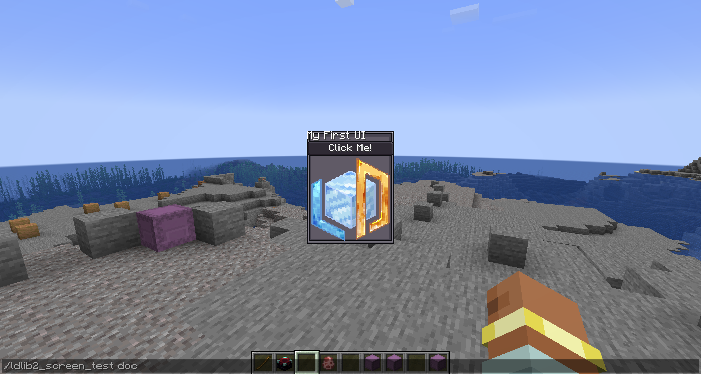
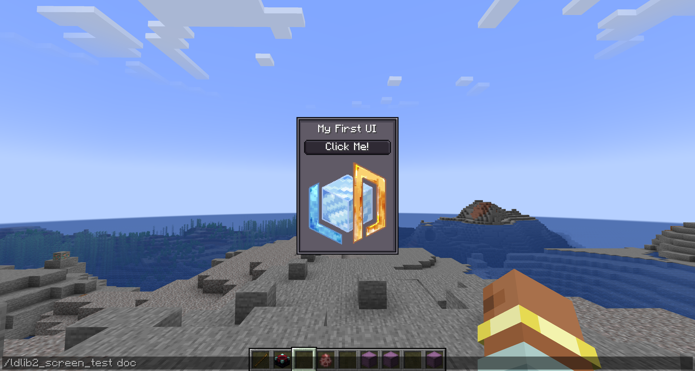
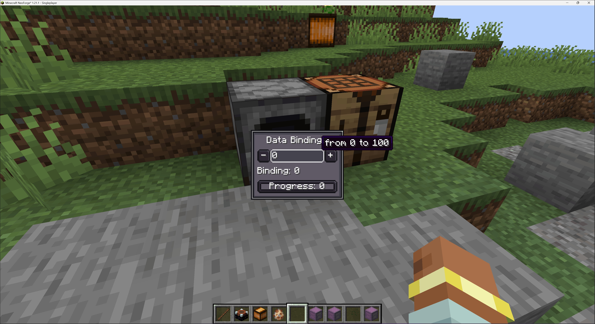

# Getting Started
{{ version_badge("2.1.0", label="Since", icon="tag") }}

In this section, we will give you some examples step by step.

### Tutorial 1: create and display a `ModularUI` in your screen

Let's start with a simple UI.
A `ModularUI` acts as the runtime manager for your UI — handling lifecycle, rendering, and interactions for all elements you define. 
It takes a `UI` instance and optionally a `Player` as inputs.
Check [ModularUI page](./preliminary/modularui.md){ data-preview } for more details.

```java
private static ModularUI createModularUI() {
    // create a root element
    var root = new UIElement();
    root.addChildren(
            // add a label to display text
            new Label().setText("My First UI"),
            // add a button with text
            new Button().setText("Click Me!"),
            // add an element to display an image based on a resource location
            new UIElement().layout(layout -> layout.width(80).height(80))
                    .style(style -> style.background(
                            SpriteTexture.of("ldlib2:textures/gui/icon.png"))
                    )
    ).style(style -> style.background(Sprites.BORDER)); // set a background for the root element
    // create a UI
    var ui = UI.of(root);
    // return a modular UI for runtime instance
    return ModularUI.of(ui);
}
```

Next, we need to display our UI.
Unlike most UI libraries that force you to use a dedicated screen class,
LDLib2 provides a universal solution for rendering and interacting with a `ModularUI` inside any screen you choose.
This means you can create and initialize a `ModularUI` during the screen’s initialization stage, as shown below.

```java
@OnlyIn(Dist.CLIENT)
public class MyScreen extends Screen {
    // .....

    // initial
    @Override
    public void init() {
        super.init();
        var modularUI = createModularUI();
        modularUI.setScreenAndInit(this);
        this.addRenderableWidget(modularUI.getWidget());
    }

    // .....
}
```

!!! info "Quick Test"
    If you dont want to cope with the code of the `screen` and display. We also provide the `ModularUIScreen` for you. 
    Check [screen and menu page](./preliminary/screen_and_menu.md){ data-preview } for more details.

    ```java
    public static void openScreenUI() {
        var modularUI = createModularUI();
        minecraft.setScreen(new ModularUIScreen(modularUI, Component.empty()));
    }
    ```
    
<figure markdown="span">
  { width="80%" }
</figure>

---

### Tutorial 2: better layout and style
Fine, it works — but the layout and styling are still not ideal.
For example, we want to add padding to the root element, introduce some spacing between components, and center-align the label.
Thanks to the yoga, we do need to cope with layout code. Check [layout page](./preliminary/layout.md){ data-preview } for more details.
Let’s improve the UI by refining its layout and style. 

```java hl_lines="7-8 17-18" 
private static ModularUI createModularUI() {
    // create a root element
    var root = new UIElement();
    root.addChildren(
            // add a label to display text
            new Label().setText("My First UI")
                    // center align text
                    .textStyle(textStyle -> textStyle.textAlignHorizontal(Horizontal.CENTER)),
            // add a button with text
            new Button().setText("Click Me!"),
            // add an element to display an image based on a resource location
            new UIElement().layout(layout -> layout.width(80).height(80))
                    .style(style -> style.background(
                            SpriteTexture.of("ldlib2:textures/gui/icon.png"))
                    )
    ).style(style -> style.background(Sprites.BORDER)); // set a background for the root element
    // set padding and gap for children elements
    root.layout(layout -> layout.paddingAll(7).gapAll(5));
    // create a UI
    var ui = UI.of(root);
    // return a modular UI for runtime instance
    return ModularUI.of(ui);
}
```

<figure markdown="span">
  { width="80%" }
</figure>

---

### Tutorial 3: component interaction and UI events

Let's see how to interact with components. Here we take the button as examples, `#!java setOnClick()` is provided by the button.
We introduce two buttons that rotate an image by ±45°.

```java hl_lines="15-26"
private static ModularUI createModularUI() {
    // create a root element
    var root = new UIElement();
    // add an element to display an image based on a resource location
    var image = new UIElement().layout(layout -> layout.width(80).height(80))
            .style(style -> style.background(
                    SpriteTexture.of("ldlib2:textures/gui/icon.png"))
            );
    root.addChildren(
            // add a label to display text
            new Label().setText("Interaction")
                    // center align text
                    .textStyle(textStyle -> textStyle.textAlignHorizontal(Horizontal.CENTER)),
            image,
            // add a container with the row flex direction
            new UIElement().layout(layout -> layout.flexDirection(YogaFlexDirection.ROW)).addChildren(
                    // a button to rotate the image -45°
                    new Button().setText("-45°")
                            .setOnClick(e -> image.transform(transform -> 
                                    transform.rotation(transform.rotation()-45))),
                    new UIElement().layout(layout -> layout.flex(1)), // occupies the remaining space
                    // a button to rotate the image 45°
                    new Button().setText("+45°")
                            .setOnClick(e -> image.transform(transform -> 
                                    transform.rotation(transform.rotation() + 45)))
            )
    ).style(style -> style.background(Sprites.BORDER)); // set a background for the root element
    // set padding and gap for children elements
    root.layout(layout -> layout.paddingAll(7).gapAll(5));
    // create a UI
    var ui = UI.of(root);
    // return a modular UI for runtime instance
    return ModularUI.of(ui);
}
```

<figure markdown="span">
  { width="80%" }
</figure>

In the previous step, we used `Button#setOnClick()` to handle interactions.
While this is convenient, it is only an API method only provided by the Button component.

LDLib2 itself exposes a complete and flexible UI event system. 
Any UIElement can listen to input events such as mouse clicks, hover, command, lifecycle, drag, focus, keyboard input, etc. Check [event page](./preliminary/event.md){ data-preview } for more details.

By combining a basic UIElement with event listeners and styles, you can implement fully custom interactive components—including buttons.


```java hl_lines="17-26"
private static ModularUI createModularUI() {
    // create a root element
    var root = new UIElement();
    // add an element to display an image based on a resource location
    var image = new UIElement().layout(layout -> layout.width(80).height(80))
            .style(style -> style.background(
                    SpriteTexture.of("ldlib2:textures/gui/icon.png"))
            );
    root.addChildren(
            // add a label to display text
            new Label().setText("UI Event")
                    // center align text
                    .textStyle(textStyle -> textStyle.textAlignHorizontal(Horizontal.CENTER)),
            image,
            // add a container with the row flex direction
            new UIElement().layout(layout -> layout.flexDirection(YogaFlexDirection.ROW)).addChildren(
                    // implement the button by using ui events
                    new UIElement().addChild(new Label().setText("-45°").textStyle(textStyle -> textStyle.adaptiveWidth(true)))
                            .layout(layout -> layout.justifyItems(YogaJustify.CENTER).paddingHorizontal(3))
                            .style(style -> style.background(Sprites.BORDER1))
                            .addEventListener(UIEvents.MOUSE_DOWN, e -> image.transform(transform ->
                                    transform.rotation(transform.rotation()-45)))
                            .addEventListener(UIEvents.MOUSE_ENTER, e ->
                                    e.currentElement.style(style -> style.background(Sprites.BORDER1_DARK)), true)
                            .addEventListener(UIEvents.MOUSE_LEAVE, e ->
                                    e.currentElement.style(style -> style.background(Sprites.BORDER1)), true),
                    new UIElement().layout(layout -> layout.flex(1)), // occupies the remaining space
                    // a button to rotate the image 45°
                    new Button().setText("+45°")
                            .setOnClick(e -> image.transform(transform ->
                                    transform.rotation(transform.rotation() + 45)))
            )
    ).style(style -> style.background(Sprites.BORDER)); // set a background for the root element
    // set padding and gap for children elements
    root.layout(layout -> layout.paddingAll(7).gapAll(5));
    // create a UI
    var ui = UI.of(root);
    // return a modular UI for runtime instance
    return ModularUI.of(ui);
}
```

<figure markdown="span">
  { width="80%" }
</figure>

---

## Tutorial 4: UI stylesheet

In [Tutorial 2](#tutorial-2-better-layout-and-style), we improved the layout and visual appearance by configuring layout and style directly in code.
While this works well, inline layout and style definitions can quickly become verbose and harder to maintain as the UI grows.

To address this, LDLib2 introduces a stylesheet system called `LSS` (LDLib2 StyleSheet).
LSS allows you to describe layout and style properties in a declarative, CSS-like way, separating visual design from UI structure. Check [stylesheet page](./preliminary/stylesheet.md){ data-preview } for more details.

In the examples below, we reimplement the layout and style logic from Step 3 using LSS:

* Example 1 demonstrates LSS bindings directly on UI elements
* Example 2 shows how to define a standalone stylesheet and apply it to the UI

=== "example 1"

    ```java
    private static ModularUI createModularUI() {
        var root = new UIElement();
        root.addChildren(
                new Label().setText("LSS example")
                        .lss("horizontal-align", "center"),
                new Button().setText("Click Me!"),
                new UIElement()
                        .lss("width", 80)
                        .lss("height", 80)
                        .lss("background", "sprite(ldlib2:textures/gui/icon.png)")
        );
        root.lss("background", "built-in(ui-gdp:BORDER)");
        root.lss("padding-all", 7);
        root.lss("gap-all", 5);
        var ui = UI.of(root);
        return ModularUI.of(ui);
    }
    ```

=== "example 2"

    ```java
    private static ModularUI createModularUI() {
        // set root with an ID
        var root = new UIElement().setId("root");
        root.addChildren(
                new Label().setText("LSS example"),
                new Button().setText("Click Me!"),
                // set the element with a class
                new UIElement().addClass("image")
        );
        var lss = """
            // id selector
            #root {
                background: built-in(ui-gdp:BORDER);
                padding-all: 7;
                gap-all: 5;
            }
            
            // class selector
            .image {
                width: 80;
                height: 80;
                background: sprite(ldlib2:textures/gui/icon.png);
            }
            
            // element selector
            #root label {
                horizontal-align: center;
            }
            """;
        var stylesheet = Stylesheet.parse(lss);
        // add stylesheets to ui
        var ui = UI.of(root, stylesheet);
        return ModularUI.of(ui);
    }
    ```

!!! info "Built-in Stylesheets"
    In addition to custom LSS definitions, LDLib2 also provides several **built-in stylesheet** themes that cover most common UI components:

    - `#!java StylesheetManager.GDP`
    - `#!java StylesheetManager.MC`
    - `#!java StylesheetManager.MODERN`

    These built-in stylesheets allow you to apply a consistent visual style to an entire UI with minimal setup.
    You can access and manage them through the `StylesheetManager`, which acts as a central registry for all available stylesheet packs. 

```java
private static ModularUI createModularUI() {
    var root = new UIElement();
    root.layout(layout -> layout.width(100));
    root.addChildren(
            new Label().setText("Stylesheets"),
            new Button().setText("Click Me!"),
            new ProgressBar().setProgress(0.5f).label(label -> label.setText("Progress")),
            new Toggle().setText("Toggle"),
            new TextField().setText("Text Field"),
            new UIElement().layout(layout -> layout.setFlexDirection(YogaFlexDirection.ROW)).addChildren(
                    new ItemSlot().setItem(Items.APPLE.getDefaultInstance()),
                    new FluidSlot().setFluid(new FluidStack(Fluids.WATER, 1000))
            ),
            // list all stylesheets
            new Selector<ResourceLocation>()
                    .setSelected(StylesheetManager.GDP, false)
                    .setCandidates(StylesheetManager.INSTANCE.getAllPackStylesheets().stream().toList())
                    .setOnValueChanged(selected -> {
                        // switch to the selected stylesheet
                        var mui = root.getModularUI();
                        if (mui != null) {
                            mui.getStyleEngine().clearAllStylesheets();
                            mui.getStyleEngine().addStylesheet(StylesheetManager.INSTANCE.getStylesheetSafe(selected));
                        }
                    })
    );
    root.addClass("panel_bg");
    // use GDP stylesheets by default
    var ui = UI.of(root, StylesheetManager.INSTANCE.getStylesheetSafe(StylesheetManager.GDP)));
    return ModularUI.of(ui);
}
```

<figure markdown="span">
  { width="80%" }
</figure>

---

## Tutorial 5: data bindings

LDLib2 provides built-in data binding support for most data-driven UI components.
This allows UI elements to stay in sync with underlying data without manual update logic.
The binding system is based on `#!java IObserver<T>` and `#!java IDataProvider<T>`. 
Check [data bindings page](./preliminary/data_bindings.md){ data-preview } for more details.

In this example:

- A shared AtomicInteger acts as the single source of truth
- Buttons modify the value directly
- The TextField updates the value through an observer
- Labels and the progress bar automatically refresh when the data changes

```java
private static ModularUI createModularUI() {
    // a value holder
    var valueHolder = new AtomicInteger(0);

    var root = new UIElement();
    root.addChildren(
            new Label().setText("Data Bindings")
                    .textStyle(textStyle -> textStyle.textAlignHorizontal(Horizontal.CENTER)),
            new UIElement().layout(layout -> layout.flexDirection(YogaFlexDirection.ROW)).addChildren(
                    // button to decrease the value
                    new Button().setText("-")
                            .setOnClick(e -> {
                                if (valueHolder.get() > 0) {
                                    valueHolder.decrementAndGet();
                                }
                            }),
                    new TextField()
                            .setNumbersOnlyInt(0, 100)
                            .setValue(String.valueOf(valueHolder.get()))
                            // bind an Observer to update the value holder
                            .bindObserver(value -> valueHolder.set(Integer.parseInt(value)))
                            // bind a DataSource to notify the value changes
                            .bindDataSource(SupplierDataSource.of(() -> String.valueOf(valueHolder.get())))
                            .layout(layout -> layout.flex(1)),
                    // button to increase the value
                    new Button().setText("+")
                            .setOnClick(e -> {
                                if (valueHolder.get() < 100) {
                                    valueHolder.incrementAndGet();
                                }
                            })
            ),
            // bind a DataSource to notify the value changes for label and progress bar
            new Label().bindDataSource(SupplierDataSource.of(() -> Component.literal("Binding: ").append(String.valueOf(valueHolder.get())))),
            new ProgressBar()
                    .setProgress(valueHolder.get() / 100f)
                    .bindDataSource(SupplierDataSource.of(() -> valueHolder.get() / 100f))
                    .label(label -> label.bindDataSource(SupplierDataSource.of(() -> Component.literal("Progress: ").append(String.valueOf(valueHolder.get())))))
    ).style(style -> style.background(Sprites.BORDER));
    root.layout(layout -> layout.width(100).paddingAll(7).gapAll(5));
    return ModularUI.of(UI.of(root));
}
```

<figure markdown="span">
  { width="80%" }
</figure>

---

## Tutorial 6: `ModularUI` for Menu

In the previous tutorials, we focused on rendering　`ModularUI` inside client-side screens.
This works well for purely visual or client-only interfaces.

However, most real-world GUIs in Minecraft are server–client synchronized.
When a GUI involves gameplay logic or persistent data, the server must stay authoritative.
In vanilla Minecraft, this is handled through a `Menu`, which manages synchronization between the server and client.

Unlike UI libraries that only support client-side rendering, LDLib2 provides first-class support for server-backed Menus.
You can use `ModularUI` directly with a Menu, and no additional networking or synchronization code is required.

Let's create a simple Menu-based UI that displays the player’s inventory.

```java
private static ModularUI createModularUI(Player player) {
    var root = new UIElement();
    root.addChildren(
            new Label().setText("Menu UI"),
            // add player invotry 
            new InventorySlots()
    ).addClass("panel_bg");

    var ui = UI.of(root, StylesheetManager.INSTANCE.getStylesheetSafe(StylesheetManager.GDP));
    // pass the player to the Modular UI
    return ModularUI.of(ui, player);
}
```

You have to create a `ModularUI` with a `Player`, which is necessary for the menu-based UI. Besides, not only the screen, you should also init the `ModularUI` for your `Menu` as well. The initialization should be done after creation and before writing the extra data buffer.

```java
public class MyContainerMenu extends AbstractContainerMenu {
    // you can do initialization in the constructor
    public MyContainerMenu(...) {
        super(...)
        
        var modularUI = createModularUI(player)
        // we have added mixin to make the AbstractContainerMenu implementing the interface
        if (this instanceof IModularUIHolderMenu holder) {
            holder.setModularUI(modularUI);
        }
    }

    // .....
}
```

!!! info "Quick Test"
    To use and open a menu-based UI, you need to register your own `MenuType`, LDLib2 also provide the `ModularUIContainerScreen` and `ModularUIContainerMenu` to help you set this up quickly. Check [screen and menu page](./preliminary/screen_and_menu.md){ data-preview } for more details. 

    Alternatively, you can get started even faster by using the provided [factories](./factory.md){ data-preview }.
    They allow you to create menu-based UIs for blocks, items, or players with minimal setup—without dealing with manual registration or boilerplate code.
    In this case, we use the `PlayerUIMenuType` for quick demo.

    ```java
    public static final ResourceLocation UI_ID = LDLib2.id("unique_id");

    // register your ui somewhere, e.g. during your mod initialization.
    public static void registerPlayerUI() {
        PlayerUIMenuType.register(UI_ID, ignored -> player -> createModularUI(player));
    }
    
    public static void openMenuUI(Player player) {
        PlayerUIMenuType.openUI(player, UI_ID);
    }
    ```

<figure markdown="span">
  { width="80%" }
</figure>

---

## Tutorial 7: communication between Screen and Menu

While the `InventorySlots` works out of the box, they are pre-packaged built-in components.
In real projects, you often need more control over how data and events flow between the client-side screen and the server-side menu.

ModularUI provides full support for `data bindings` and `event dispatch` across client and server.
This allows UI interactions on the client to safely trigger logic on the server, and server-side state changes to automatically update the UI. 
Check [data bindings page](./preliminary/data_bindings.md){ data-preview } for more details. 

Here, we focus on practical patterns to help you get started quickly. 

```java
// represents data on the server
private final ItemStackHandler itemHandler = new ItemStackHandler(2);
private final FluidTank fluidTank = new FluidTank(2000);
private boolean bool = true;
private String string = "hello";
private float number = 0.5f;

private static ModularUI createModularUI(Player player) {
    // create a root element
    var root = new UIElement();
    root.addChildren(
            // add a label to display text
            new Label().setText("Data Between Screen and Menu"),
            // bind storage to slots
            new UIElement().addChildren(
                    new ItemSlot().bind(itemHandler, 0),
                    new ItemSlot().bind(new ItemHandlerSlot(itemHandler, 1).setCanTake(p -> false)),
                    new FluidSlot().bind(fluidTank, 0)
            ).layout(l -> l.gapAll(2).flexDirection(YogaFlexDirection.ROW)),
            // bind value to the components
            new UIElement().addChildren(
                    new Switch().bind(DataBindingBuilder.bool(() -> bool, value -> bool = value).build()),
                    new TextField().bind(DataBindingBuilder.string(() -> string, value -> string = value).build()),
                    new Scroller.Horizontal().bind(DataBindingBuilder.floatVal(() -> number, value -> number = value).build()),
                    // read-only (s->c), always get data from the server and display on the client
                    new Label().bind(DataBindingBuilder.componentS2C(() -> Component.literal("s->c only: ")
                            .append(Component.literal(String.valueOf(bool)).withStyle(ChatFormatting.AQUA)).append(" ")
                            .append(Component.literal(string).withStyle(ChatFormatting.RED)).append(" ")
                            .append(Component.literal("%.2f".formatted(number)).withStyle(ChatFormatting.YELLOW)))
                            .build())
            ).layout(l -> l.gapAll(2)),
            // trigger ui events on the server side
            new Button().addServerEventListener(UIEvents.MOUSE_DOWN, e -> {
                if (fluidTank.getFluid().getFluid() == Fluids.WATER) {
                    fluidTank.setFluid(new FluidStack(Fluids.LAVA, 1000));
                } else {
                    fluidTank.setFluid(new FluidStack(Fluids.WATER, 1000));
                }
            }),
            // you could also use button.setOnServerClick(e -> { ... })
            new InventorySlots()
    );
    root.addClass("panel_bg");

    // pass the player to the Modular UI
    return ModularUI.of(UI.of(root, StylesheetManager.INSTANCE.getStylesheetSafe(StylesheetManager.MODERN)), player);
}
```

<figure markdown="span">
  { width="80%" }
</figure>

---

## Ending

This is far from over. Why not give the powerful [UI editor](./ui_editor/index.md){ data-preview } a try?