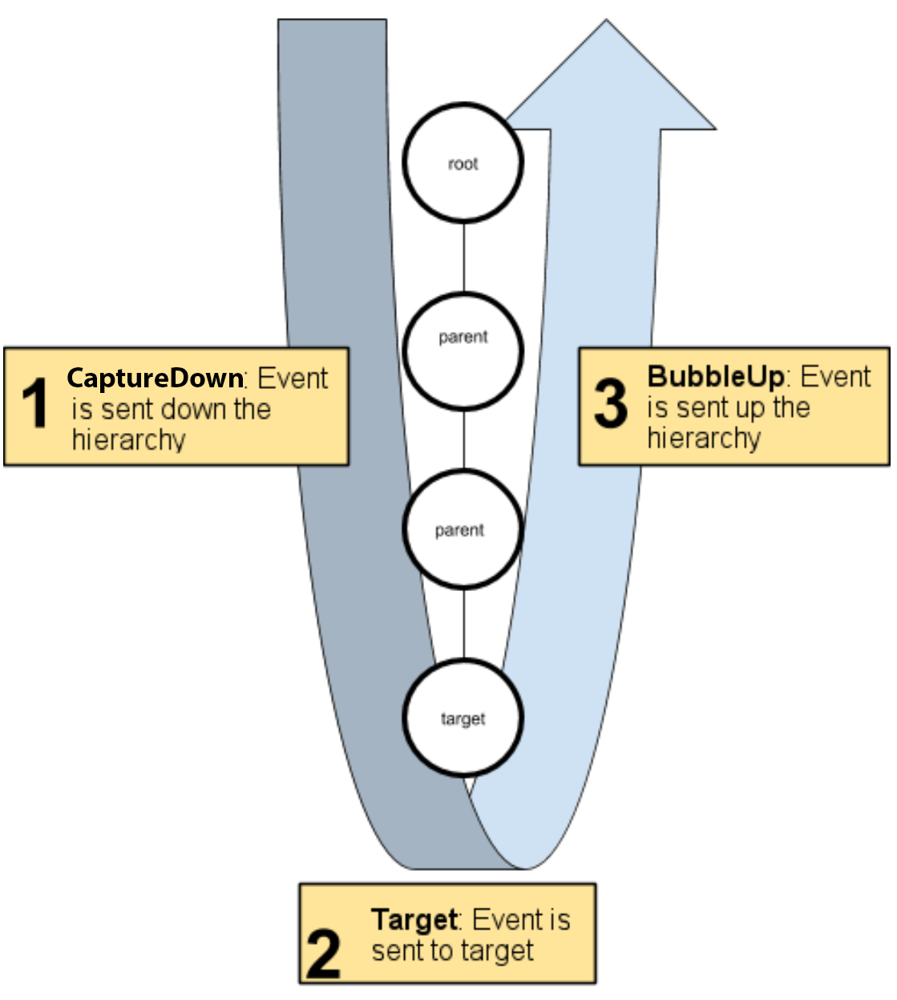
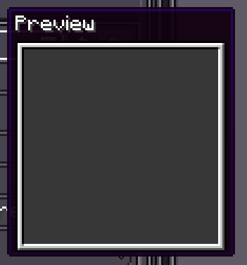

# Event

{{ version_badge("2.1.0", label="Since", icon="tag") }}

LDLib2 UI provides events that communicate user actions or notifications to UI elements. The event system shares the same terminology and event naming as [HTML events](https://developer.mozilla.org/en-US/docs/Learn_web_development/Core/Scripting/Events#what_is_an_event).

---

## Dispatch events

The event system listens for events that come from the ModularUI or mannually triggers, then uses the `UIEventDispatcher` to dispatch those events to UI elements. The event dispatcher determines an appropriate dispatching strategy for each event it sends. Once determined, the dispatcher executes the strategy.

### Event propagation
Each event phase has its own dispatch behavior. The behavior of each event type breaks down into two stages:

- `Capture Phase`: Events sent to elements during the capture-down phase.
- `Bubbles Phase`: Events sent to elements during the bubble-up phase.

After the event dispatcher selects the event `target`, it computes the propagation path of the event. The propagation path is an ordered list of UI elements that receive the event. The propagation path occurs in the following order:

1. The path starts at the root of the UI element tree and descends towards the `target`. This is the capture-down phase.
2. The event target receives the event.
3. The event then ascends the tree towards the root. This is the bubble-up phase.

<figure markdown="span" style="width: 60%">
  
  <figcaption>Propagation path</figcaption>
</figure>


Most event are sent to all elements along the propagation path. Some event skip the bubble-up phase, and some event are sent to the event target only.

### Event target

As a `UIEvent` travels along the propagation path, `UIEvent.currentElement` is updated to the element that is **currently handling** the event. This makes it easy to know “which element is running my listener right now”.

Within an event listener, LDLib2 distinguishes two important element references:

- **`UIEvent.target`**: the element where the event **originated** (the dispatch target).
- **`UIEvent.relatedTarget`(Optional)**: the other element may be involved in some events.
- **`UIEvent.currentElement`**: the element whose listener is **currently being executed**.

`target` is determined before dispatch begins and **does not change** during propagation.  
`currentElement` changes as the dispatcher moves through the tree (capture → target → bubble).

### Stopping propagation

LDLib2 provides two levels of cancellation:

- `event.stopPropagation()`  
  Stops the event from reaching **later elements and later phases** (capture/bubble will cease).

- `event.stopImmediatePropagation()`  
  Stops other listeners on the **current element** from running, and also stops further propagation.

---

## Register event listeners

LDLib2 uses a **DOM-like event model**: events travel through the UI tree and a listener can be registered for either:

- **Bubble phase** (default)
- **Capture phase** (set `useCapture = true`)

Use `addEventListener(eventType, listener)` to register a **bubble-phase** listener:

=== "Java"

    ```java
    var root = new UIElement().setId("root");
    var button = new UIElement().setId("button");
    root.addChild(button);

    // UIEvents.CLICK == "mouseClick"
    button.addEventListener(UIEvents.CLICK, e -> {
        LDLib2.LOGGER.info("Bubble listener: current={}, target={}",
                e.currentElement.getId(), e.target.getId());
    });
    ```

=== "KubeJS"

    ```js
    let root = new UIElement().setId("root");
    let button = new UIElement().setId("button");
    root.addChild(button);

    // UIEvents.CLICK == "mouseClick"
    button.addEventListener(UIEvents.CLICK, e => {
        console.log(`Bubble listener: current=${e.currentElement.getId()}, target=${e.target.getId()}`);
    });
    ```

To register a capture-phase listener, pass true as the third argument:

=== "Java"

    ```java
    root.addEventListener(UIEvents.CLICK, e -> {
        LDLib2.LOGGER.info("Capture: current={}, target={}",
                e.currentElement.getId(), e.target.getId());
    }, true);
    ```

=== "KubeJS"

    ```js
    root.addEventListener(UIEvents.CLICK, e => {
        console.log(`Capture: current=${e.currentElement.getId()}, target=${e.target.getId()}`);
    }, true);
    ```

We also provide method allow you to listen events on the `server`. Events are triggered on the client-side and sync to the server. Not all events support server listeners, check [Event reference](#event-reference) below.


=== "Java"

    ```java
    root.addServerEventListener(UIEvents.CLICK, e -> {
        LDLib2.LOGGER.info("Triggered on the server";
    });
    ```

=== "KubeJS"

    ```js
    root.addServerEventListener(UIEvents.CLICK, e => {
        console.log("Triggered on the server");
    });
    ```

To remove a listener, call `removeEventListener(...)`.
Make sure the useCapture flag matches how the listener was registered:

=== "Java"

    ```java
    UIEventListener onClick = e -> LDLib2.LOGGER.info("clicked!");

    button.addEventListener(UIEvents.CLICK, onClick);       // bubble
    root.addEventListener(UIEvents.CLICK, onClick, true);   // capture

    button.removeEventListener(UIEvents.CLICK, onClick);          // remove bubble listener
    root.removeEventListener(UIEvents.CLICK, onClick, true);      // remove capture listener
    ```

=== "KubeJS"

    ```js
    let onClick = UIEventListener.creatre(e => LDLib2.LOGGER.info("clicked!"));

    button.addEventListener(UIEvents.CLICK, onClick);       // bubble
    root.addEventListener(UIEvents.CLICK, onClick, true);   // capture

    button.removeEventListener(UIEvents.CLICK, onClick);          // remove bubble listener
    root.removeEventListener(UIEvents.CLICK, onClick, true);      // remove capture listener
    ```

---

## Event reference

LDLib2 raises an event when a user interacts with and changes the state of elements. The event design is similar to the Event interface for HTML elements.

Event types fit into a hierarchy based on the `UIEvent.class`. Each event family implements an interface that defines the common characteristics of all events of the same family.

Here, we list common events available for all ui elemetns below. Select any of the event types listed below for more information on the event, and links to the API documentation.

!!! note
    We'd recommend to use `UIEvents.xxx` instead of an event type string.


### Mouse Events

Mouse Events are most used events. Event sent after a handler starts capturing the mouse.

| Event | Description | Capture down | Bubbles up | Support Server |
| ----- | ----------- | ------------ | ---------- | ---------- |
| `mouseDown` | Fired when the user presses a mouse button. | ✅ | ✅ | ✅ |
| `mouseUp` | Fired when the user releases a mouse button. | ✅ | ✅ | ✅ |
| `mouseClick` | Fired when the user clicks a mouse button (press + release). | ✅ | ✅ | ✅ |
| `doubleClick` | Fired when the user double-clicks a mouse button. | ✅ | ✅ | ✅ |
| `mouseMove` | Fired when the mouse moves over the element. | ✅ | ✅ | ✅ |
| `mouseEnter` | Fired when the mouse enters an element or one of its descendants. | ✅ | ❌ | ✅ |
| `mouseLeave` | Fired when the mouse leaves an element or one of its descendants. | ✅ | ❌ | ✅ |
| `mouseWheel` | Fired when the user scrolls the mouse wheel. | ✅ | ✅ | ✅ |


| Field | Description | Supported Event |
| ----- | ----------- | --------------- |
| `x` | mouse position x | All |
| `y` | mouse position y | All |
| `button` | mouse button code (0 - left, 1 - right, 2 - middle, others...) | `mouseDown` `mouseUp` `mouseClick` `doubleClick` |
| `deltaX` | scroll delta x | `mouseWheel` |
| `deltaY` | scroll delta y | `mouseWheel` |

**Usage**

=== "Java"

    ```java
    elem.addEventListener(UIEvents.DOUBLE_CLICK, e -> {
        LDLib2.LOGGER.info("double click {} with button {}", e.target, e.button)
    });
    ```

=== "KubeJS"

    ```js
    elem.addEventListener(UIEvents.DOUBLE_CLICK, e => {
        console.log(`double click ${e.target} with button ${e.button}`)
    });
    ```

---

### Drag and Drop Events

Drag and drop events are dispatched during drag operations.
**These events are client-side only and will not be sent to the server.**

| Event              | Description  | Capture down | Bubbles up | Support Server |
| ------------------ | ------------ | ------------ | ---------- | ---------- |
| `dragEnter`        | Fired when the pointer enters an element during a drag operation. | ✅ | ❌ | ❌ |
| `dragLeave`        | Fired when the pointer leaves an element during a drag operation. | ✅ | ❌ | ❌ |
| `dragUpdate`       | Fired when the pointer moves over an element during dragging.     | ✅ | ✅ | ❌ |
| `dragSourceUpdate` | Fired on the drag source while dragging.                          | ✅ | ❌ | ❌ |
| `dragPerform`      | Fired when the dragged object is released over an element.        | ✅ | ❌ | ❌ |
| `dragEnd`          | Fired on the drag source when the drag operation ends.            | ✅ | ❌ | ❌ |

| Field | Description | Supported Event |
| ----- | ----------- | --------------- |
| `x` | mouse position x | All |
| `y` | mouse position y | All |
| `relatedTarget` | If the relatedTarget is not null, it means the new element entered. | `dragLeave` |
| `deltaX` | dragging delta x | All |
| `deltaY` | dragging delta y | All |
| `dragStartX` | start position x before dragging | All |
| `dragStartY` | start position y before dragging | All |
| `dragHandler` | DragHandler is used to handle drag events. | All |


All drag events will only be triggered after the drag is started `startDrag`. The drag and drop lifecycle is as follows:

1. To trigger dragging, for example, in mouse events, you can call `startDrag`.
2. do something with drag events, `dragEnter`, `dragLeave`, `dragUpdate`, and `dragSourceUpdate` (if th drag source is defined).
3. When the drag is finished, trigger `dragPerform`, and `dragEnd` (if th drag source is defined)

**Method: `#!java DragHandler.startDrag(Object draggingObject, IGuiTexture dragTexture, UIElement dragSource)`**

Parameters:

- `draggingObject`: the object being dragged; can be of any type to represent the drag payload
- `dragTexture`: used to visually represent the drag operation
- `dragSource`: the `UIElement` that acts as the source of the drag operation

!!! note
    `dragSourceUpdate` and `dragEnd` are only dispatched to the drag source.

You could also start a drag by using `UIElement.startDrag` which can help you pass the `dragSource` directly.

**Usage**

=== "Java"

    ```java
    elem.addEventListener(UIEvents.MOUSE_DOWN, e -> {
        // start drag when the mouse down
        elem.startDrag(null, null);
    });
    elem.addEventListener(UIEvents.DRAG_SOURCE_UPDATE, e -> {
        LDLib2.LOGGER.info("{} dragged ({}, {})", e.target, e.deltaX, e.deltaY)
    });
    ```

=== "KubeJS"

    ```js
    elem.addEventListener(UIEvents.MOUSE_DOWN, e => {
        // start drag when the mouse down
        elem.startDrag(null, null);
    });
    elem.addEventListener(UIEvents.DRAG_SOURCE_UPDATE, e => {
        copnsole.log(`${e.target} dragged (${e.deltaX}, ${e.deltaY})`)
    });
    ```

---

### Focus Events

Focus events are dispatched when `focusable` elements gain or lose focus.

| Event      | Description                                   | Capture down | Bubbles up | Support Server |
| ---------- | --------------------------------------------- | ------------ | ---------- | ---------- |
| `focusIn`  | Fired when an element is about to gain focus. | ✅ | ❌ | ❌ |
| `focus`    | Fired after an element has gained focus.      | ✅ | ❌ | ✅ |
| `focusOut` | Fired when an element is about to lose focus. | ✅ | ❌ | ❌ |
| `blur`     | Fired after an element has lost focus.        | ✅ | ❌ | ✅ |

| Field | Description | Supported Event |
| ----- | ----------- | --------------- |
| `relatedTarget` | For `focusIn` and `focus`, refers to last focused element. <br> For `focusOut` and `blur`, refers to last focused element. | All |

!!! note
    - `focusIn` and `focusOut` are **not sent to the server**.
    - `relatedTarget` indicates the element losing or gaining focus.

**Usage**

=== "Java"

    ```java
    elem.setFocusable(true)
    elem.addEventListener(UIEvents.MOUSE_DOWN, e -> {
        // request focus
        elem.focus();
    });
    elem.addEventListener(UIEvents.FOCUS, e -> {
        LDLib2.LOGGER.info("{} gained the focus", elem);
    });
    ```

=== "KubeJS"

    ```js
    elem.setFocusable(true)
    elem.addEventListener(UIEvents.MOUSE_DOWN, e => {
        // request focus
        elem.focus();
    });
    elem.addEventListener(UIEvents.FOCUS, e => {
        console.log(`${elem} gained the focus`);
    });
    ```

---

### Keyboard Events

Keyboard events are dispatched to the element that currently has **focus**.

| Event     | Description                                         | Capture down | Bubbles up | Support Server |
| --------- | --------------------------------------------------- | ------------ | ---------- | ---------- |
| `keyDown` | Fired when the user presses a key on the keyboard.  | ✅ | ✅ | ✅ |
| `keyUp`   | Fired when the user releases a key on the keyboard. | ✅ | ✅ | ✅ |


| Field | Description | Supported Event |
| ----- | ----------- | --------------- |
| `keyCode` | key code | All |
| `scanCode` | sccan code | All |
| `modifiers` | modifiers | All |

**Usage**

=== "Java"

    ```java
    elem.setFocusable(true)
    elem.addEventListener(UIEvents.MOUSE_DOWN, e -> {
        // request focus
        elem.focus();
    });
    elem.addEventListener(UIEvents.KEY_DOWN, e -> {
        LDLib2.LOGGER.info("key {} pressed", e.keyCode);
    });
    ```

=== "KubeJS"

    ```js
    elem.setFocusable(true)
    elem.addEventListener(UIEvents.MOUSE_DOWN, e => {
        // request focus
        elem.focus();
    });
    elem.addEventListener(UIEvents.KEY_DOWN, e => {
        console.log(`key ${e.keyCode} pressed`)
    });
    ```

---

### Text Input Events

Text input events are used for character-level input, such as typing into text fields, which also dispatched to the element that currently has **focus**.

| Event       | Description                                      | Capture down | Bubbles up | Support Server |
| ----------- | ------------------------------------------------ | ------------ | ---------- | ---------- |
| `charTyped` | Fired when a character is input into an element. | ❌ | ❌ | ✅ |

| Field | Description | Supported Event |
| ----- | ----------- | --------------- |
| `codePoint` | code point | All |
| `modifiers` | modifiers | All |

**Usage**

=== "Java"

    ```java
    elem.setFocusable(true)
    elem.addEventListener(UIEvents.MOUSE_DOWN, e -> {
        // request focus
        elem.focus();
    });
    elem.addEventListener(UIEvents.CHAR_TYPED, e -> {
        LDLib2.LOGGER.info("key {} pressed", e.codePoint);
    });
    ```

=== "KubeJS"

    ```js
    elem.setFocusable(true)
    elem.addEventListener(UIEvents.MOUSE_DOWN, e => {
        // request focus
        elem.focus();
    });
    elem.addEventListener(UIEvents.CHAR_TYPED, e => {
        console.log(`key ${e.codePoint} pressed`)
    });
    ```
---

### Hover Tooltip Events

Hover tooltip events are dispatched when dynamic tooltip information needs to be shown.


| Event           | Description                                  | Capture down | Bubbles up | Support Server |
| --------------- | -------------------------------------------- | ------------ | ---------- | ---------- |
| `hoverTooltips` | Fired to provide hover tooltip content for an element. | ❌ | ❌ | ❌ |

| Field | Description | Supported Event |
| ----- | ----------- | --------------- |
| `hoverTooltips` | Set your hover tooltips to display | All |

!!! info "TooltipComponent"
    { align=right width="200" }
    `hoverTooltips` allow you to append a `TooltipComponent` after text components. You could append a LDLib2 UI into the tooltip by using `ModularUITooltipComponent`.
    

**Usage**

=== "Java"

    ```java
    elem.addEventListener(UIEvents.HOVER_TOOLTIPS, e -> {
        e.hoverTooltips = HoverTooltips.empty()
            // add text tooltips
            .append(Component.literal("Hello"), Component.literal("World"))
            // add a image
            .tooltipComponent(new ModularUITooltipComponent(new UIElement().layout(layout -> {
                layout.width(100).height(100);
            }).style(style -> style.background(SpriteTexture.of("ldlib2:textures/gui/icon.png")))));
    });
    ```

=== "KubeJS"

    ```js
    elem.addEventListener(UIEvents.HOVER_TOOLTIPS, e => {
        e.hoverTooltips = HoverTooltips.empty()
            // add text tooltips
            .append("Hello", "World");
            // add a image
            .tooltipComponent(new ModularUITooltipComponent(new UIElement().layout(layout => {
                layout.width(100).height(100);
            }).style(style => style.background(SpriteTexture.of("ldlib2:textures/gui/icon.png")))));
    });
    ```
---

### Command Events

Command events are used to handle high-level UI commands (e.g. copy, paste, select all).
They follow a validation → execution flow. To claim a command during `validateCommand`, call `UIEvent.stopPropagation()`.

| Event             | Description                     | Capture down | Bubbles up | Support Server |
| ----------------- | ------------------------------- | ------------ | ---------- | ---------- |
| `validateCommand` | Fired to check whether an element can handle a command. | ❌ | ❌ | ❌ |
| `executeCommand`  | Fired when a command is executed on an element.         | ❌ | ❌ | ❌ |

| Field | Description | Supported Event |
| ----- | ----------- | --------------- |
| `keyCode` | key code | All |
| `scanCode` | sccan code | All |
| `modifiers` | modifiers | All |
| `command` | command | All |

**Commands**

| Command | Description |
| ----- | ----------- |
| `copy` | ctrl + c |
| `cut` | ctrl + x |
| `paste` | ctrl + v |
| `select-all` | ctrl + a |
| `undo` | ctrl + z |
| `redo` | ctrl + y / ctrl + shift + z |
| `find` | ctrl + f |
| `save` | ctrl + s |


!!! note
    If a command input is detected. A command event will be sent to the `focus` element first (if exists). If it doesn't be consumed, it will be sent to the UI tree elements until an element cconsumes it.

**Usage**

=== "Java"

    ```java
    elem.addEventListener(UIEvents.VALIDATE_COMMAND, e -> {
        if (CommandEvents.COPY.equals(event.command)) {
            // notify cosnuming
            event.stopPropagation();
        }
    });

    elem.addEventListener(UIEvents.EXECUTE_COMMAND, e -> {
        if (CommandEvents.COPY.equals(event.command)) {
            ClipboardManager.copyDirect("data");
        }
    });
    ```

=== "KubeJS"

    ```js
    elem.addEventListener(UIEvents.VALIDATE_COMMAND, e => {
        if (CommandEvents.COPY == event.command) {
            // notify cosnuming
            event.stopPropagation();
        }
    });

    elem.addEventListener(UIEvents.EXECUTE_COMMAND, e => {
        if (CommandEvents.COPY == event.command) {
            ClipboardManager.copyDirect("data");
        }
    });
    ```

---

### Layout Events

Layout events are dispatched when the layout state of an element changes.

| Event           | Description                                  | Capture down | Bubbles up | Support Server |
| --------------- | -------------------------------------------- | ------------ | ---------- | ---------- |
| `layoutChanged` | Fired when the yoga layout of an element changes. | ❌ | ❌ | ❌ |


**Usage**

=== "Java"

    ```java
    elem.addEventListener(UIEvents.LAYOUT_CHANGED, e -> {
        LDLib2.LOGGER.info("{} layout changed", e.target)
    });
    ```

=== "KubeJS"

    ```js
    elem.addEventListener(UIEvents.LAYOUT_CHANGED, e => {
        console.log(`${e.target} layout changed`)
    });
    ```

---

### Lifecycle Events

Lifecycle events describe changes to an element’s presence in the UI tree.

| Event        | Description                                       | Capture down | Bubbles up | Support Server |
| ------------ | ------------------------------------------------- | ------------ | ---------- | ---------- |
| `added`      | Fired when the element is added to the UI tree.        | ❌            | ❌          | ❌ |
| `removed`    | Fired when the element is removed from the UI tree.    | ❌            | ❌          | ❌ |
| `muiChanged` | Fired when the element’s `ModularUI` instance changes. | ❌            | ❌          | ❌ |

!!! note
    `removed` will be sent not only the element removing but also UI closing. You could use this event to disponse resource.

**Usage**

=== "Java"

    ```java
    elem.addEventListener(UIEvents.REMOVED, e -> {
        // release resource here for safe
    });
    ```

=== "KubeJS"

    ```js
    elem.addEventListener(UIEvents.REMOVED, e => {
        // release resource here for safe
    });
    ```

---

### Tick Event

The tick event is dispatched once per game tick while the element is active and visible.

| Event  | Description                                           | Capture down | Bubbles up | Support Server |
| ------ | ----------------------------------------------------- | ------------ | ---------- | ---------- |
| `tick` | Fired every tick when the element is active and displayed. | ❌ | ❌ | ✅ |

!!! note
    - `tick` is not sent to the server automatically.
    - You may still listen to it on the server side if needed.


=== "Java"

    ```java
    elem.addEventListener(UIEvents.TICK, e -> {
    });
    ```

=== "KubeJS"

    ```js
    elem.addEventListener(UIEvents.TICK, e => {
    });
    ```