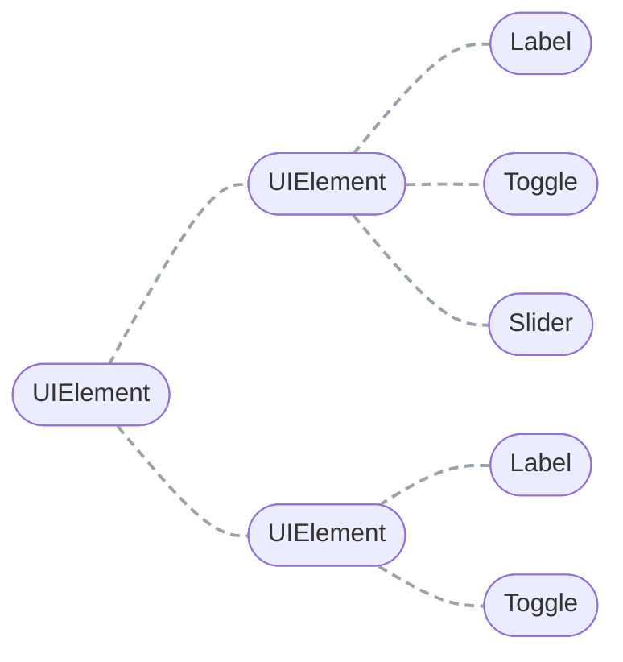
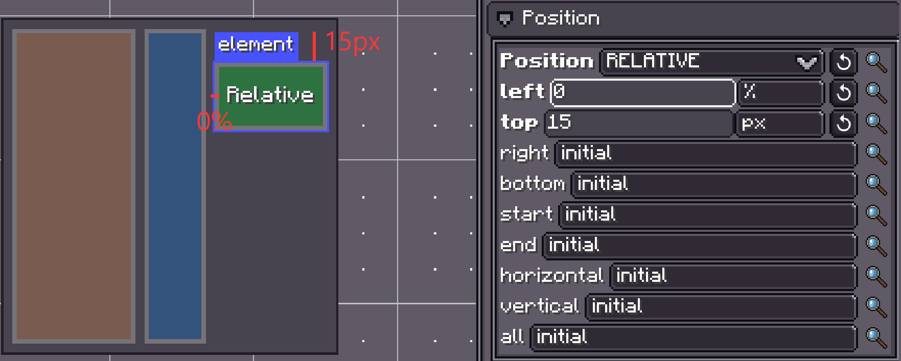
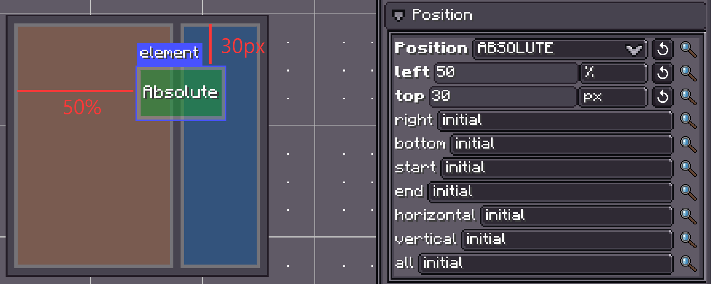
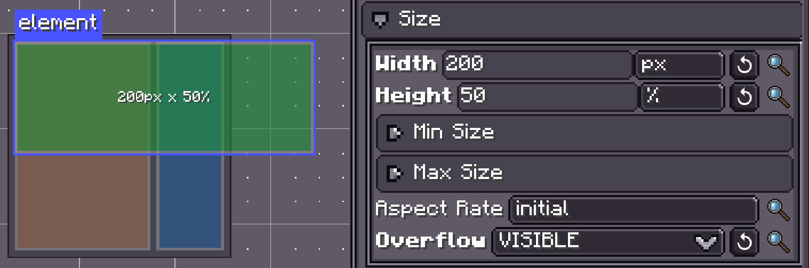
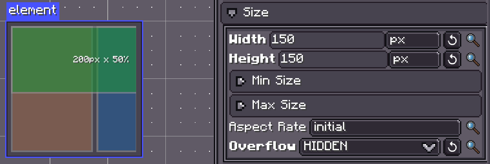
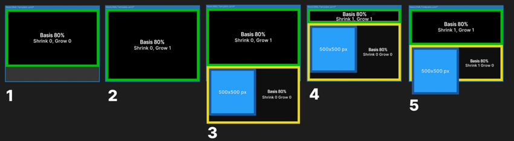
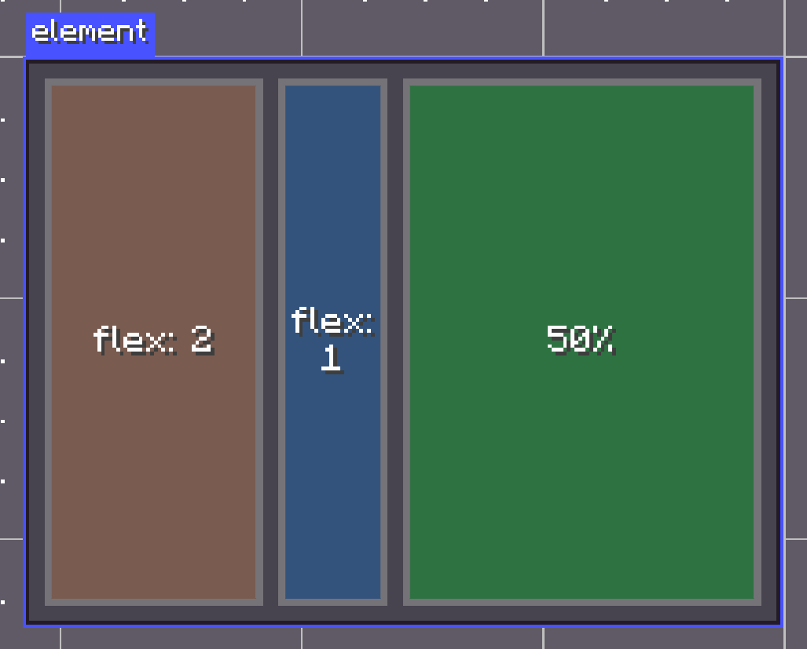
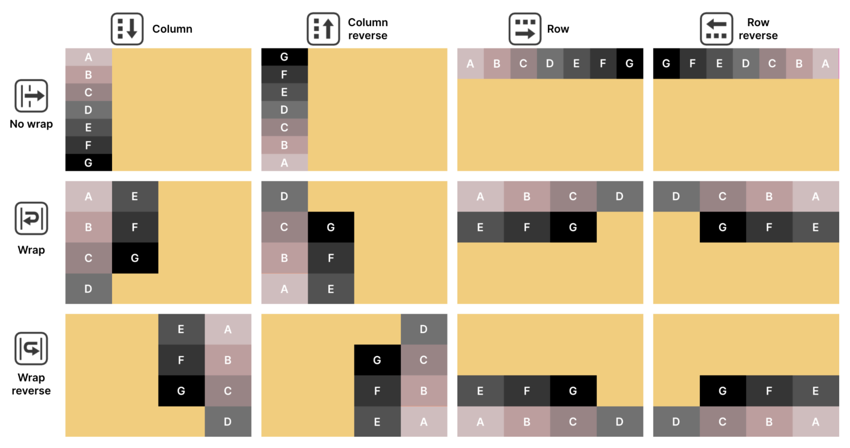
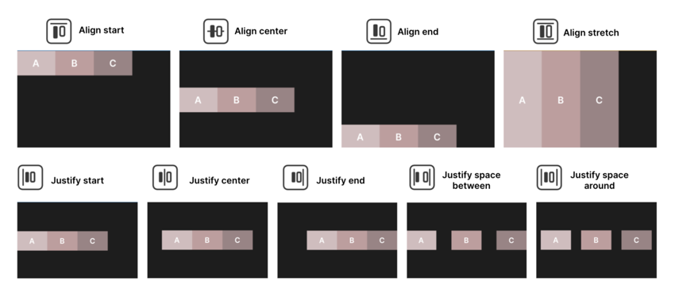
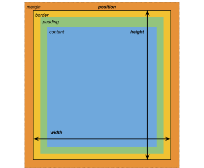

# Layout

{{ version_badge("2.1.0", label="Since", icon="tag") }}

!!! info inline end
    Grid layout support will be introduced into Yoga in the future.

LDLib2 UI layout is built on top of the [Yoga layout engine](https://www.yogalayout.dev/docs/about-yoga).

> **Yoga** is an embeddable layout system used in popular UI frameworks such as React Native.  
> It is **not** a UI framework and does not perform any rendering.  
> Its sole responsibility is calculating the **size and position** of elements.

LDLib2 adopts a **FlexBox-based layout model**, which allows you to describe complex UI structures in a flexible and predictable way.

---

## Setting Layout Properties

Each `UIElement` owns a layout object backed by Yoga.  
You can configure layout properties in multiple ways, depending on your preference and use case.

In addition to the examples below, layout properties can also be defined through  
[LSS (LDLib Style Sheet)](./stylesheet.md){ data-preview }, which is especially useful for separating layout logic from UI structure.

=== "Java"

    ```java
    var element = new UIElement();

    // Set layout directly
    element.getLayout()
            .flexDirection(YogaFlexDirection.ROW)
            .width(150)
            .heightPercent(100)
            .marginAll(10)
            .paddingAll(10);

    // Set layout using a chaining lambda
    element.layout(layout -> layout
            .flexDirection(YogaFlexDirection.ROW)
            .width(150)
            .heightPercent(100)
            .marginAll(10)
            .paddingAll(10)
    );

    // Set layout via stylesheet (LSS)
    element.lss("flex-direction", "row");
    element.lss("width", 150);
    element.lss("height-percent", 100);
    element.lss("margin-all", 10);
    element.lss("padding-all", 10);
    ```

=== "KubeJS"

    ```js
    let element = new UIElement();

    // Set layout directly
    element.getLayout()
            .flexDirection(YogaFlexDirection.ROW)
            .width(150)
            .heightPercent(100)
            .marginAll(10)
            .paddingAll(10);

    // Set layout using a chaining lambda
    element.layout(layout -> layout
            .flexDirection(YogaFlexDirection.ROW)
            .width(150)
            .heightPercent(100)
            .marginAll(10)
            .paddingAll(10)
    );

    // Set layout via stylesheet (LSS)
    element.lss("flex-direction", "row");
    element.lss("width", 150);
    element.lss("height-percent", 100);
    element.lss("margin-all", 10);
    element.lss("padding-all", 10);
    ```

---

## Learning Flex Layout

!!! info
    If you are already familiar with Flexbox, Yoga layout should feel very intuitive.  
    If not, we recommend reading the official [Yoga documentation](https://www.yogalayout.dev/docs/about-yoga) for a complete explanation.

    For a lighter introduction, this chapter focuses on the **most commonly used Flex concepts in LDLib2 UI**.


## UI Elements and Hierarchy

In LDLib2 UI, the interface is composed of **UI elements** (`UIElement`).

- A UI element represents a visual container such as a panel, button, text field, or image.
- UI elements can contain other UI elements, forming a **UI hierarchy** (also referred to as a *layout tree*).

Complex interfaces are built by combining multiple UI elements into nested hierarchies, with layout and styling rules applied at different levels.



---

## Positioning UI Elements

When designing a UI layout, think of each screen as a collection of rectangular containers arranged horizontally or vertically.

Break down the layout into logical sections, then refine each section using child containers to organize content.

---

## Positioning Modes

Yoga supports two primary positioning modes:

### Relative positioning (default)

Elements participate in the Flexbox layout of their parent container.

- Child elements are arranged according to the parent’s **Flex Direction**
- Element size and position respond dynamically to:
    - Parent layout rules (padding, alignment, spacing)
    - The element’s own size constraints (width, height, min/max size)

If layout constraints conflict, the layout engine resolves them automatically.  
For example, an element wider than its container may overflow.

### Absolute positioning

Elements are positioned relative to their parent container, but **do not participate in Flexbox layout calculations**.

- Flex properties such as Grow, Shrink, or alignment are ignored
- Elements may overlap other content
- Position is controlled using offsets such as `Top`, `Right`, `Bottom`, and `Left`

<figure markdown="span">
  
  <br>
  
  <figcaption>On the top, the blue visual element has a Relative position, with the parent element using Flex Direction: Row as the Flex setting. On the bottom, the blue visual element uses Absolute position and ignores the parent element’s Flexbox rules.</figcaption>
</figure>

---

## Size Settings

UI elements are containers by default.

- Without explicit size rules, an element may expand to fill available space or collapse to the size of its content
- `Width` and `Height` define the element’s base size
- `Min` and `Max` values limit how much an element can grow or shrink
- if you set an `Aspect Rate`, one dimension will be decided by the other one
- `Overflow` controls the clipping of an element’s content. The default value is `visible`, which means the element’s content isn’t clipped to the element’s bounds. If you set overflow to hidden, the element’s content is clipped to the element’s content bounds.
- Sizes can be expressed in pixels or percentages

These size rules interact with Flexbox settings to determine the final layout.


<figure markdown="span">
  
  <br>
  
  <figcaption>Size settings for a UI element.</figcaption>
</figure>

---

## Flex Settings

Flex settings affect how elements grow or shrink when using Relative positioning. It’s recommended that you experiment with elements to understand their behavior firsthand.

### Flex Basis

Defines the initial size of an element before Grow or Shrink is applied.

### Flex Grow

- `Flex Grow > 0` allows the element to expand and take available space
- Higher values receive a larger share of free space
- `Flex Grow = 0` prevents expansion beyond the base size


### Flex Shrink

- `Flex Shrink > 0` allows the element to shrink when space is limited
- `Flex Shrink = 0` prevents shrinking and may cause overflow

> Elements with fixed pixel sizes do not respond to Grow or Shrink.

<figure markdown="span">
    
    <figcaption>Basis, Grow, and Shrink settings.</figcaption>
</figure>

The above example shows how Basis works with the Grow and Shrink options:

1. The green element with a Basis of 80% occupies 80 percent of the available space.
2. Setting the Grow to 1 allows the green element to expand to the entire space.
3. With a yellow element added, the elements overflow the space. The green element returns to occupying 80 percent of the space.
4. A Shrink setting of 1 makes the green element shrink to fit the yellow element.

Here, both elements have a Shrink value of 1. They shrink equally to fit in the available space.

### Flex

`Flex = 1` equals to `Flex Grow = 1` and `Flex Shrink = 1`, which is used to set `Flex Grow` and `Flex Shrink` at the same time.

<figure markdown="span">
    
    <figcaption>
    In this example, we assume the root container `width: 200px`. 
    The right most element set `width: 50%`. Therefore, the left space is 100px for the left most and middle elements. According to the `flex` of them, they divided the remaining space in a `2:1` ratio. 
    </figcaption>
</figure>

---

### 💡 How element size is calculated

When using Relative positioning, the layout engine determines element size in this order:

1. Compute base size from `Width` and `Height`
2. Check whether the parent container has extra space or overflow
3. Distribute extra space using `Flex Grow`
4. Reduce size using `Flex Shrink` if space is insufficient
5. Apply constraints such as `Min/Max` size and `Flex Basis`
6. Apply the final resolved size

---

### Flex Direction and Flex Wrapping

- `Flex Direction` controls whether child elements are laid out in rows or columns
- `Flex Wrap` controls whether elements stay on a single line or wrap onto additional rows or columns

Child elements follow the order defined in the UI hierarchy.

<figure markdown="span">
    
    <figcaption>
    Parent and child UI element using Relative positioning and different Direction and Wrap combinations.
    </figcaption>
</figure>

---

## Alignment

Alignment settings control how child elements are positioned within a container.

### Align Items

Aligns elements along the cross-axis (perpendicular to the Flex Direction):

### Justify Content

Controls spacing along the main axis:

Flex Grow and Shrink values influence how space is distributed.

### Align Self

Allows an individual element to override the parent’s alignment rules.

### Align Content

Controls how **multiple rows or columns** of flex items are aligned **along the cross axis**.

!!! note
    `Align Content` only takes effect when:
    
    - The container allows wrapping (`flex-wrap: wrap`)
    - There are **multiple lines** of children


<figure markdown="span">
    
    <figcaption>
    Align and Justify settings applied to a parent element with a Direction set to Row; note that other position and sizing options can affect the final output.
    </figcaption>
</figure>

---

## Margin and Padding

LDLib2 UI follows a box model similar to CSS:

- **Content**: the element’s actual content
- **Padding**: space between content and border
- **Border**: optional boundary around the element, (avoid use it).
- **Margin**: space outside the element, separating it from others

<figure markdown="span">
    
    <figcaption>
    A UI element with defined Size, Margin, Border, and Padding settings; elements with a fixed Width or Height can overflow the space.
    </figcaption>
</figure>