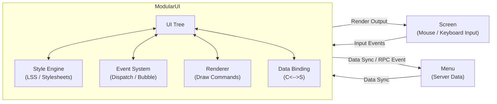
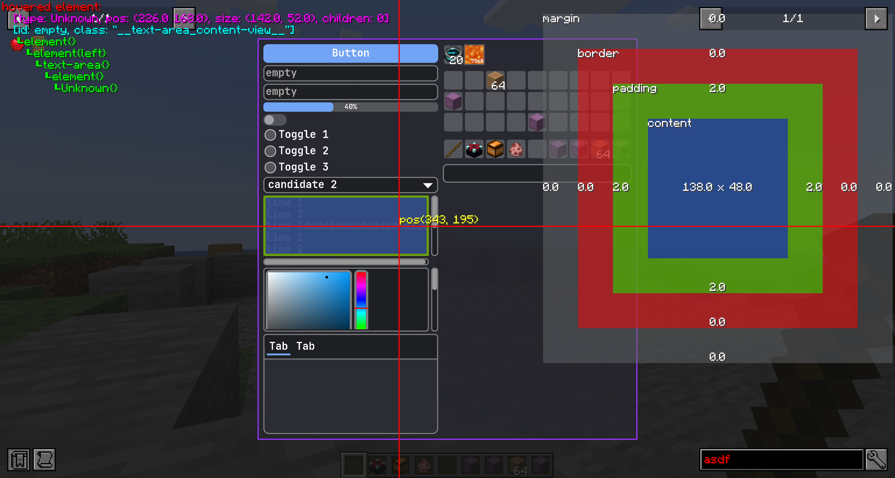

# ModularUI

{{ version_badge("2.1.0", label="Since", icon="tag") }}

This page introduces the core concepts of the **LDLib2 UI system**.
At runtime, LDLib2 uses a class called **`ModularUI`** to manage the entire UI tree.  
`ModularUI` is responsible for:

- Managing the UI lifecycle
- Handling input events
- Applying styles and stylesheets
- Coordinating rendering
- Synchronizing data between client and server (when used with Menus)

In short, **`ModularUI` is the central controller of a UI instance**.

---

## How `ModularUI` Works

The following diagram shows how `ModularUI` connects Minecraft systems with the UI tree:

---

## `ModularUI` APIs

There are two methods to create a `ModualrUI`:

- `#!java ModularUI.of(ui)`
- `#!java ModularUI.of(ui, player)`

To create a simple `client-side` only UI, the first one is enough.

The second one requires a `Player` as input, which is **NECESSARY** if your UI is a `menu-based` UI and requires data synchronization between client and server. 

### General APIs

| Method | Description |
| ---- | ----------- |
| `shouldCloseOnEsc()` | Whether the UI should close when pressing `ESC`. |
| `shouldCloseOnKeyInventory()` | Whether the UI should close when pressing the Inventory key (default: `E`). |
| `getTickCounter()` | Returns how many ticks this `ModularUI` instance has been active. |
| `getWidget()` | Returns the widget instance used by the Minecraft `Screen`. |
| `getAllElements()` | Returns an unmodifiable list of all UI elements in the UI tree. |

---

### Element Query APIs (By ID)

| Method | Description |
| ---- | ----------- |
| `getElementById(String id)` | Finds and returns the **first** UI element with the given ID, or `null` if not found. |
| `getElementsById(String id)` | Returns **all** UI elements with the given ID. |
| `hasElementWithId(String id)` | Checks whether at least one element with the given ID exists. |
| `getElementCountById(String id)` | Returns the number of elements with the given ID. |
| `getAllElementsById()` | Returns a copy of the internal mapping from ID to UI elements. |

---

### Element Query APIs (Regex & Pattern)

| Method | Description |
| ---- | ----------- |
| `getElementByIdRegex(String pattern)` | Finds the first element whose ID matches the given regex pattern. |
| `getElementsByIdRegex(String pattern)` | Finds all elements whose IDs match the given regex pattern. |
| `getElementByIdPattern(Pattern pattern)` | Same as above, but uses a precompiled `Pattern` for better performance. |
| `getElementsByIdPattern(Pattern pattern)` | Returns all elements matching a precompiled regex pattern. |

---

### Element Query APIs (Partial Matching)

| Method | Description |
| ---- | ----------- |
| `getElementsByIdContains(String substring)` | Finds all elements whose IDs contain the given substring. |
| `getElementsByIdStartsWith(String prefix)` | Finds all elements whose IDs start with the given prefix. |
| `getElementsByIdEndsWith(String suffix)` | Finds all elements whose IDs end with the given suffix. |

---

### Element Query APIs (By Type)

| Method | Description |
| ---- | ----------- |
| `getElementsByType(Class<T> type)` | Returns all UI elements of the given type. |
| `getAllElementsByType()` | Returns a copy of the internal mapping from element type to UI elements. |

!!! note
    All query methods return **copies** of internal collections when applicable. Returned lists are safe to modify and will not affect the internal UI tree.

---

## Debug your UI

During development, the UI tree may not always behave as expected,  
and it can be difficult to understand what is going wrong.

You can press **`F3`** to enable **UI debug mode**.  
When debug mode is active, LDLib2 displays helpful information directly on the screen.

<figure markdown="span">
  { width="80%" }
</figure>