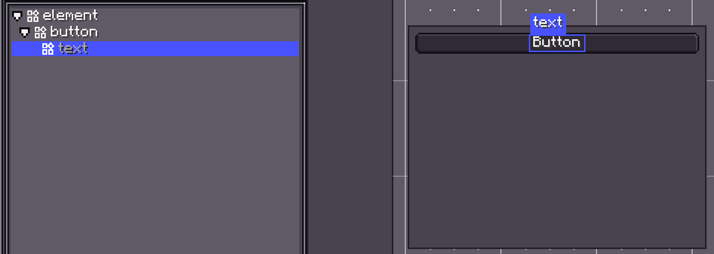
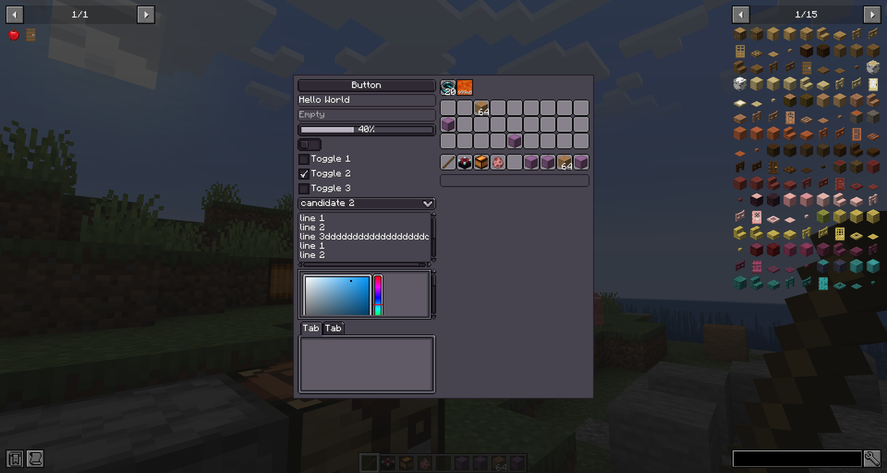
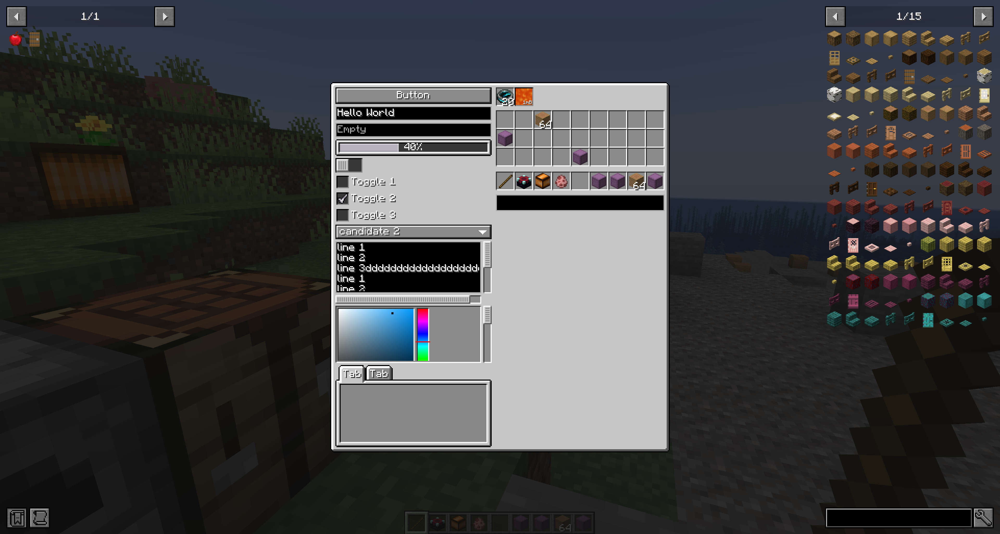
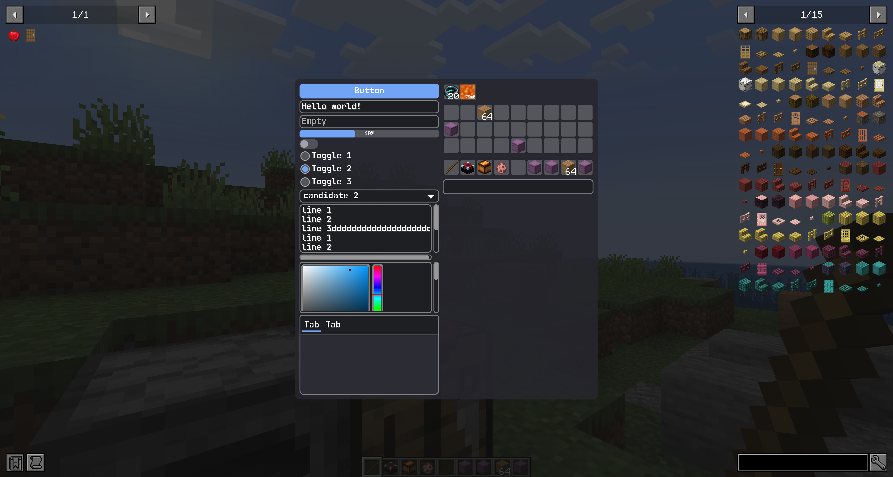
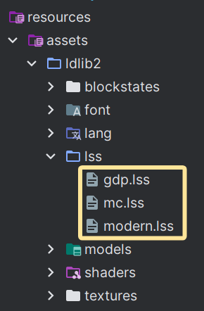

# StyleSheet

You can style your UI with a `LDLib Style Sheet` (LSS). LSS files are text files inspired by CSS from HTML. USS syntax is the same as CSS syntax, but USS includes overrides and customizations to work better with LDLib2 UI.

LSS allows you to separate **presentation** from **logic**, making UI code cleaner and easier to maintain.

---

## What Is a Style in LDLib2

Before introducing LSS itself, it is important to understand what a **Style** means in LDLib2 and how styles work internally.

If you are familiar with CSS, these concepts should feel natural.

A **Style** in LDLib2 refers to any visual or layout-related configuration that affects how a UI element is rendered, and **is not related to server-side logic**.  
Examples include:

- `layout` (size, position, flex behavior)
- `background`
- `font-size`, `alignment`, and more

In fact, the `layout` system you already know is itself a type of **Style**.

Each `UIElement` may define multiple styles, and a single style property can have multiple candidate values coming from different sources.

Internally, every UI element maintains a **StyleBag**, which:

- Stores all style values applied to the element
- Resolves conflicts between styles
- Computes the final effective style used for rendering

The final style is determined by **priority**, not by application order.

---

### Style Origin and Priority

Every style value has a **StyleOrigin**, which defines **where the style comes from** and **how strong it is**.

??? info "StyleOrigin"
    ```java
    public enum StyleOrigin {
        /**
         * Default style defined by the UI component itself
         */
        DEFAULT(0),

        /**
         * Style defined in an external stylesheet (LSS)
         */
        STYLESHEET(2),

        /**
         * Inline style set directly in code
         */
        INLINE(3),

        /**
         * Style applied by animations
         */
        ANIMATION(4),

        /**
         * Important style that overrides all others
         */
        IMPORTANT(5);
    }
    ```

Styles with a higher priority override styles with a lower priority:

> `DEFAULT` < `STYLESHEET` < `INLINE` < `ANIMATION` < `IMPORTANT`

This design ensures that:

- Components have sensible defaults
- Stylesheets define the global look
- Inline styles can override stylesheets
- Animations can temporarily override visuals
- `IMPORTANT` styles always win


### Customizable Styles

LDLib2 provides multiple ways to customize UI styles.
You can freely mix these approaches depending on your needs.

!!! note inline end
    In this page, we won't introduce all supported styles and their behaviour. Each UI component documents the styles it supports on its own wiki page.

Each UI component exposes the `Style` objects it supports, allowing you to configure styles directly through code.

For example, in [`layout`](./layout.md#setting-layout-properties), both `#layout(...)` and `#getLayout()` are based on the same underlying `Style` system.
`layout` is a shared style available on all UI Elements.

In addition, some components provide their own specialized styles.
For instance, `Button` exposes a `buttonStyle(...)` API for configuring button-specific visual properties.

---

## Customizing Styles via Code

There are many methods to set styles.

=== "Java"

    ```java
    var button = new Button();

    // direct call
    button.getStyle()
        // set background texture
        .background(SpriteTexture.of("photon:textures/icon.png"));
        // set tooltips
        .tooltips("This is my tooltips")
        // set opacity
        .opacity(0.5);

    // chain call, return button itself for chain calls
    button.buttonStyle(style -> {}).style(style -> style
        .background(SpriteTexture.of("photon:textures/icon.png"));
        .tooltips("This is my tooltips")
        .opacity(0.5)
    );

    // lss text
    button.lss("background", "sprite(ldlib2:textures/gui/icon.png)");
    button.lss("tooltips", "This is my tooltips");
    button.lss("opacity", 0.5);
    ```
=== "KubeJS"

    ```js
    let button = new Button();

    // direct call
    button.getStyle()
        // set background texture
        .background(SpriteTexture.of("photon:textures/icon.png"));
        // set tooltips
        .tooltips("This is my tooltips")
        // set opacity
        .opacity(0.5);

     // chain call, return button itself for chain calls
    button.buttonStyle(style => {}).style(style => style
        .background(SpriteTexture.of("photon:textures/icon.png"));
        .tooltips("This is my tooltips")
        .opacity(0.5)
    );

    // lss text
    button.lss("background", "sprite(ldlib2:textures/gui/icon.png)");
    button.lss("tooltips", "This is my tooltips");
    button.lss("opacity", 0.5);
    ```

All of the methods above can be used to set styles, but they are **not equivalent**.

* Using `getStyle()` or `style(...)` sets styles with the `INLINE` origin by default.
* Using `lss(...)` sets styles with the `STYLESHEET` origin by default.

If you want to assign styles using these APIs **with a different `StyleOrigin`**, you can explicitly specify the origin when applying the style, as shown below:

=== "Java"

    ```java
    Style.pipeline(StyleOrigin.IMPORTANT, button.getStyle(), style -> style
        .tooltips("This is my tooltips")
    );

    // lss text
    button.lss("tooltips", "This is my tooltips", StyleOrigin.DEFAULT);
    ```
=== "KubeJS"

    ```js
    Style.pipeline("IMPORTANT", button.getStyle(), style => style
        .tooltips("This is my tooltips")
    );

    // lss text
    button.lss("tooltips", "This is my tooltips", "DEFAULT");
    ```

---

## Customizing Styles via stylesheet

Although styling UI elements directly in code is convenient, it quickly becomes **tedious and repetitive** when your project involves a large amount of UI design.

In particular:

* Applying the same styles to many UI elements requires repeated code.
* Updating a shared style (for example, changing a background texture) may require modifying every related UI element manually.

More importantly, if you want your UI styles to be **customizable by players**—for example, allowing styles to be overridden via resource packs—managing styles purely in code becomes impractical.

Using **stylesheets (LSS)** allows you to:

* Centralize and reuse styles across multiple UI elements.
* Modify the appearance of the entire UI from a single place.
* Expose UI styling to resource packs for easy customization.

For these reasons, stylesheets are the recommended way to manage and unify UI styles for big project.

### Syntax
If you are familiar with CSS, you will be very familiar with the syntax of LSS.

A LSS consists of the following:

* Style rules that include a `selector` and a `declaration block`.
* Selectors that identify which ui element the style rule affects.
* A declaration block, inside curly braces, that has one or more style declarations. Each style declaration has a property and a value. Each style declaration ends with a semi-colon.

**Style matching with rules**

The following is the general syntax of a style rule:

```css
selector {
    property1: value;
    property2: value;
}
```

When you define a stylesheet, you can apply it to the ui tree. Selectors match against elements to resolve which properties apply from the LSS. If a selector matches an element, the style declarations apply to the element.

For example, the following rule matches any `Button` object:
```css
button {
  base-background: built-in(ui-mc:RECT_BORDER);
  hover-background: built-in(ui-mc:RECT_3);
  pressed-background: built-in(ui-mc:RECT_3) color(#dddddd);
  padding-all: 3;
  height: 16;
}
```

**Supported selector types**
LSS supports several types of simple and complex selectors that match elements based on different criteria, such as the following:

- Component type name
- An assigned `id`
- A list of LSS `classes`
- The element’s position in the ui tree and its relationship to other elements

If an element matches more than one selector, LSS applies the styles from whichever selector takes precedence.

LSS supports a set of simple selectors that are analogous, but not identical, to simple selectors in CSS. The following table provides a quick reference of LSS simple selectors.

| Selector type | Syntax | Matches|
| ---- | ----------- | ----------- |
| Component selector | `type {...}` | Elements of a specific component type. <br> (e.g. `button`, `text-field`, `toogle`) |
| Class selector | `.class {...}` | Elements with an assigned LSS class. <br> (e.g. `.__focused__`) |
| ID selector | `#root {...}` | Elements with an assigned `id`. <br> (e.g. `#root`) |
| Universal selector | `* {...}` | Any elements. |

LSS supports a subset of CSS complex selectors. The following table provides a quick reference of LSS complex selectors.

| Selector type | Syntax | Matches|
| ---- | ----------- | ----------- |
| Not selector | `:not(selector) {...}` | Elements that not match the selector. |
| Host selector | `selector:host {...}` | Elements that must be the `host`. |
| Internal selector | `selector:internal {...}` | Elements that must be the `internal`. |
| Descendant selector | `selector1 selector2 {...}` | Elements that are the descendant of another element in the ui tree. |
| Child selector | `selector1 > selector2 {...}` | Elements that are the children of another element in the ui tree. |
| Multiple selector | `selector1, selector2 {...}` | Elements that match all the simple selectors. |

!!! info "`Host` and `Internal` Element"
    A UI tree can contain both **host elements** and **internal elements**.

    Using **`button`** as an example:

    * The `button` itself is a **host element**. It is a component that you create and interact with directly.
    * Internally, a `button` contains other UI elements, such as a `text` used to render its label.

    

    These internal elements are part of the component’s implementation and are called **internal elements**, which cannot be removed from the UI tree and diplayed in gray.

    You normally don’t need to create or manage them manually, but they still exist in the UI tree and can participate in layout, styling, and event propagation.

    This distinction allows LDLib2 components to be both **composable** and **customizable**, while keeping their internal structure encapsulated.


??? note "supported characters"
    -  Must begin with a letter (`A–Z` or `a–z`) or an underscore (`_`).
    - Can contain letters, digits (`0–9`), hyphens (`-`), and underscores (`_`).
    - Selectors are case-sensitive. For example, myClass and MyClass are different.
    - Selectors can’t start with a digit or a hyphen followed by a digit (for example, `.1class` or `.-1class`).

**Quiz**

What kind of elements will be selected here?
```css
button:host :not(.my_label#my_id > text:internal) > .my_class:host, text-field {
    // ...
}
```

??? info "Answer"
    1. **All `text-field` elements**, regardless of their position in the UI tree.

    2. **Host elements with the class `my_class`**, with the following constraints:
        - The element must be a **host element**.
        - Its **direct parent** must **not** be an internal `text` element whose parent is an element with `my_label` class and with the ID `my_id`.
        - The element must have a **host `button` ancestor** somewhere above it in the UI tree.


### Apply stylesheet

To apply your stylesheets, you can append them during `UI` creation.

=== "Java"

    ```java hl_lines="30-32"
    private static ModularUI createModularUI() {
        // set root with an ID
        var root = new UIElement().setId("root");
        root.addChildren(
                new Label().setText("LSS example"),
                new Button().setText("Click Me!"),
                // set the element with a class
                new UIElement().addClass("image")
        );
        var lss = """
            // id selector
            #root {
                background: built-in(ui-gdp:BORDER);
                padding-all: 7;
                gap-all: 5;
            }
            
            // class selector
            .image {
                width: 80;
                height: 80;
                background: sprite(ldlib2:textures/gui/icon.png);
            }
            
            // element selector
            #root label {
                horizontal-align: center;
            }
            """;
        var stylesheet = Stylesheet.parse(lss);
        // add stylesheets to ui
        var ui = UI.of(root, stylesheet);
        return ModularUI.of(ui);
    }
    ```
=== "KubeJS"

    ```js hl_lines="30-32"
    function createModularUI() {
        // set root with an ID
        let root = new UIElement().setId("root");
        root.addChildren(
                new Label().setText("LSS example"),
                new Button().setText("Click Me!"),
                // set the element with a class
                new UIElement().addClass("image")
        );
        let lss = `
            // id selector
            #root {
                background: built-in(ui-gdp:BORDER);
                padding-all: 7;
                gap-all: 5;
            }
            
            // class selector
            .image {
                width: 80;
                height: 80;
                background: sprite(ldlib2:textures/gui/icon.png);
            }
            
            // element selector
            #root label {
                horizontal-align: center;
            }
        `;
        let stylesheet = Stylesheet.parse(lss);
        // add stylesheets to ui
        let ui = UI.of(root, stylesheet);
        return ModularUI.of(ui);
    }
    ```

You could also modify stylesheets at runtime.

=== "Java"

    ```java
    var mui = elem.getModularUI();
    if (mui != null) {
        mui.getStyleEngine().addStylesheet(stylesheet);
    }
    ```
=== "KubeJS"

    ```js
    let mui = elem.getModularUI();
    if (mui != null) {
        mui.getStyleEngine().addStylesheet(stylesheet);
    }
    ```

### Builtin Stylesheets

LDLib2 provides three builtin stylesheets `gdp`, `mc`, and `modern`, allows you to  switch themes flexibly.
`gdp` is the default stylesheet while using LDLib2 components.

You can use `StylesheetManager` to access all registered stylesheets.

=== "Java"

    ```java hl_lines="30-32"
    private static ModularUI createModularUI() {
        // ...
        var stylesheet = StylesheetManager.INSTANCE.getStylesheetSafe(StylesheetManager.MC)
        return ModularUI.of(UI.of(root, stylesheet));
    }
    ```
=== "KubeJS"

    ```js hl_lines="30-32"
    function createModularUI() {
        // ...
        let stylesheet = StylesheetManager.INSTANCE.getStylesheetSafe(StylesheetManager.MC)
        return ModularUI.of(UI.of(root, stylesheet));
    }
    ```

All three builtin stylesheets as below:

<figure markdown="span">
    
    <figcaption>
    GDP
    </figcaption>
    
    <figcaption>
    MC
    </figcaption>
    
    <figcaption>
    MODERN
    </figcaption>
</figure>

### Stylesheets from resourcepack

!!! note inline end
    

    Don't foget `F3 + T` to reload resource after modification at runtime.

In practice, stylesheets can be added or overridden via resource packs.
By placing your `LSS` files in the designated path, `StylesheetManager` will automatically discover and register them at runtime while reload resources.

You should place your stylesheets under the path of `.assets/<namespace>/lss/<name>.lss`.

After register, you are able to access them by using `StylesheetManager`.

=== "Java"

    ```java
    // replace <namespace> and <name> with your own.
    StylesheetManager.INSTANCE.getStylesheetSafe(
        ResourceLocation.parse("<namespace>:lss/<name>.lss")
    );
    ```
=== "KubeJS"

    ```js
    // replace <namespace> and <name> with your own.
    StylesheetManager.INSTANCE.getStylesheetSafe(
        "<namespace>:lss/<name>.lss"
    );
    ```