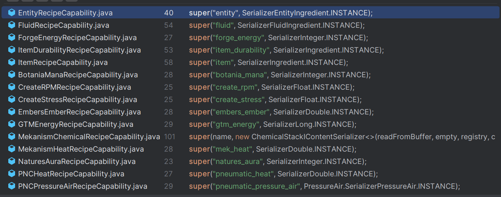

# Recipe Creation

Add reipces to the recipe type (`id = mbd2:blender`).

```javascript
// server script
ServerEvents.recipes((event) => {
    // add recipes here
    event.recipes.mbd2.blender()
        // recipe id is optional, but we recommend to set a unique id
        .id("mbd2:recipe_id")
        // duration in tick
        .duration(400)
        // hight priority will be handled first
        .priority(-1)
        // mark this recipe as a fuel recipe
        .isFuel(true)
        // item
        .inputItems("minecraft:apple", "4x minecraft:oak_log")
        .outputItems("4x minecraft:apple")
        // fluid
        .inputFluids("water 1000")
        .outputFluids("lava 2000")
        // forge energy
        .inputFE(1000)
        .outputFE(2000)
        // create stress
        .inputStress(1024)
        .outputStress(2048)
        // botaina mana
        .inputMana(100)
        .outputMana(200)
        // mek heat
        .inputHeat(100)
        .outputHeat(200)
        // gtm eu
        .inputEU(100)
        .outputEU(200)
        // mek chemicals
        .inputGases("100x mekanism:hydrogen")
        .outputGases("200x mekanism:oxygen")
            // .inputInfusions(...) 
            // .outputInfusions(...) 
            // .inputSlurries(...)
            // .outputSlurries(...)
            // .inputPigments(...)
            // .outputPigments(...)
        // per tick (consume / generate per tick)
        .perTick(builder => builder
            .inputFluids("10x lava") 
        )
        // chance
        .chance(0.5, builder => builder
            .inputFluids("10x lava")
        )
        // tier chance boost (the final chance = chance + tierChanceBoost * machineLevel)
        .tierChanceBoost(0.1, builder => builder
            .inputFluids("10x lava")
        )
        // slot name (ingredient can only be consumed/filled from given slot name (trait name))
        .slotName("input_tank", builder => builder
            .inputFluids("10x lava")
        )
        // ui name (ingredient displays in the xei recipe ui (widget id) by a given ui name)
        .uiName("input_tank", builder => builder
            .inputFluids("10x lava")
        )
        // condtions
        .dimension("minecraft:overworld") // dimension id
        .biome("minecraft:plains") // biome id
        .machineLevel(2) // min machine level
        .positionY(-10, 64) // min y, max y
        .raining(0.5, 1) // min level, max level
        .thundering(0.5, 1) // min level, max level
        .blocksInStructure(0, 100, "minecraft:stone") // min count, max count, blocks
        // custom data
        .addData("key", '{"temperature": 32}')
        .addDataString("key", "value")
        .addDataNumber("key", 32)
        .addDataBoolean("key", true)
})
```

More apis and details can be found here: [MBDRecipeSchema](https://github.com/Low-Drag-MC/Multiblocked2/blob/1.20.1/src/main/java/com/lowdragmc/mbd2/integration/kubejs/recipe/MBDRecipeSchema.java)

## Create dynamic recipes via KubeJS recipe builder

You can dynamically modify recipes by using the `onBeforeRecipeModify` event to apply a modifier and replace the original recipe. In most cases, this approach is sufficient. 
However, there are times when you may want more flexibility—such as removing, replacing, or appending ingredients. To support this, we offer an alternative method that allows you to define recipes in a way similar to KJS recipe events.

```js
MBDMachineEvents.onBeforeRecipeModify('machine:id', (event) => {
    const mbdEvent = event.getEvent();
    const { machine, recipe } = mbdEvent;
    
    // creat an empty builder
    // let newEmptyRecipeBuilder = recipe.recipeType.recipeBuilder();
    // create a builder with current recipe
    let builder = recipe.toBuilder();

    builder.duration(412) // modify duration
    builder.inputItems("apple") // append ingredient
    
    let fluidCap = MBDRegistries.RECIPE_CAPABILITIES.get("fluid")
    builder.removeOutputs(fluidCap) // remove all output fluid ingredients

    let newRecipe = builder.buildMBDRecipe();
    mbdEvent.setRecipe(newRecipe );
});
```