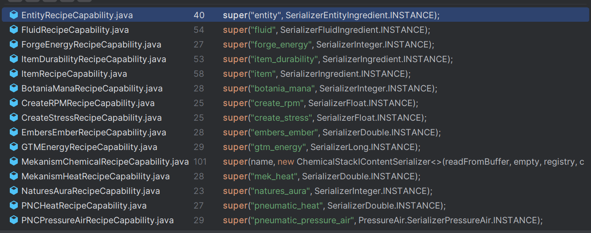

# Dynamic recipe on the fly

## Upgrade System

Credit: @yellowcake3d 
For anyone in the future seeking for a way to make this sorta upgrade system, here's what I have, which is quite practically mostly from mierno, but instead I ended up using the `getTraitByName` and also had to turn on the "Always modify recipe" checkmark in the mbd editor
```js
MBDMachineEvents.onBeforeRecipeModify('mbd2:high_pressure_electrolyzer', (event) => {
    const mbdEvent = event.getEvent();
    const { machine, recipe } = mbdEvent;

    let itemTrait = machine.getTraitByName("item_slot");
    if (itemTrait == null) return;
    let storage = itemTrait.storage;
    let upgradeCount = storage.getStackInSlot(0).count;

    //parallel recipe modifiers, the more upgrades in the upgrade slot, the more recipes processed in parallel
    let parallelRecipe = machine.applyParallel(recipe, upgradeCount);
    let copyRecipe = parallelRecipe.copy();
    //speed modifier, makes recipe go 1% faster every new upgrade installed
    let reductionFactor = Math.max(1 - 0.01 * upgradeCount, 0.1);
    copyRecipe.duration = Math.ceil(recipe.duration * reductionFactor);

    mbdEvent.setRecipe(copyRecipe);
});
```

## Create dynamic recipes via KubeJS recipe builder

You can dynamically modify recipes by using the `onBeforeRecipeModify` event to apply a modifier and replace the original recipe. In most cases, this approach is sufficient. 
However, there are times when you may want more flexibility—such as removing, replacing, or appending ingredients. To support this, we offer an alternative method that allows you to define recipes in a way similar to KJS recipe events.

```js
MBDMachineEvents.onBeforeRecipeModify('machine:id', (event) => {
    const mbdEvent = event.getEvent();
    const { machine, recipe } = mbdEvent;
    
    // creat an empty builder
    // let newEmptyRecipeBuilder = recipe.recipeType.recipeBuilder();
    // create a builder with current recipe
    let builder = recipe.toBuilder();

    builder.duration(412) // modify duration
    builder.inputItems("apple") // append ingredient
    
    let fluidCap = MBDRegistries.RECIPE_CAPABILITIES.get("fluid")
    builder.removeOutputs(fluidCap) // remove all output fluid ingredients

    let newRecipe = builder.buildMBDRecipe();
    mbdEvent.setRecipe(newRecipe );
});
```