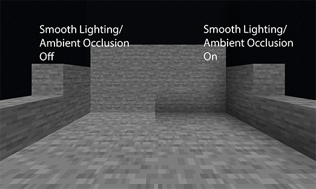

# Info

Single block machines are machines that do not require a structure to become formed.
They can operate as a self-contained machine, or as a part in a multiblock, allowing for more advanced multiblocks.

These features from other mods would fall under this category (non-exhaustive): Mek tanks, Thermal Centrifuge, PnC Air Compressor.

## Basic Settings

Always remember to change the `id` field. Not doing so will cause a crash if you have two or more machines with the same id.

    
Block Properties

### Render Types:
changes the render type(s) of your block, each type having different levels of restrictiveness, select the lowest one that works for best performance. 
* Render in Solid: something like a furnace, no clear parts or holes. 
* Render in Cutout: can have fully transparent 'holes', but no partly transparent parts. i.e. Glass, but not stained-glass. 
*    Render in Cutout Mipped: same as Cutout, but Mipmaps apply, which can cause some wierd visuals. 
    [does this matter with geckolib render? what does having multiple selected do?]

    
Example image of mipmaps at work, right is with mipmaps. (source minecraft.wiki)

    

### Use AO (ambient occlusion):
AO is the darkening around corners of blocks.

    
Ambient Occlusion at work

    

### Rotation State
### Collision
Does the player collide with the block.
### Can Occlude
Does the block apply AO to neighboring blocks.
### Ignited by Lava
Should the block catch fire when a lava spark lands on it.
### Is air
\[what does this change?]
### Is suffocating
Should mobs suffocate if their head is inside of this block.
### Emissive
Emissive makes the block always appear fully lit, regardless of light level, but does not emmit light.
### Friction
How slippery the block is. Ice blocks have lower friction.
### Speed factor
How fast you walk on it.
### Jump factor
How high you can jump off of the block.
### Break time (hardness)
How long in seconds it takes to mine the block (before tool)
### Explosion resistance
How hard it is to blow up.
## Block sounds
\[wip]
### Transparent
Weather the block blocks light (?)
### Force Solid
Enabled bypasses the block collision shape, and uses a full cube. (?)
### No particles on break
Removes the block break particles.

Item Properties

Machines Settings

### Machine Level
The level of the machine. Recipes can require a machine level. Allows better machines to execute more/better recipes.
### Has UI
If the machine has a GUI, opens on Right-click.
### Drop machine item when broken
Should the machine drop itself when broken. If the machine was formed from a candidate block, will drop original block instead.
### Redstone Connection
Should redstone dust redirect to connect to this face.

Has Recipe Logic

### Recipe Damping Value
When a recipe gets interrupted, how fast will it loose progress.
### Always Re-search Recipe
Check for compatible recipes every time one is interrupted. (?)
### Always modify Recipe
* False: re-runs a recipe when it finishes.
* True: re-applies the recipe modifiers, as if it was the first consecutive time the recipe was executed. Used for custom dynamic recipe modifiers.
### Recipe Type
The recipe type project the machine executes.
### Recipe Modifiers
The modifiers the machine applies to its recipes. 
See #RecipeModifier

Multiblock Part Settings

Settings for the block if it is used as a part of a multiblock.
### Can share
If multiple multiblocks can share this part.
### Recipe Modifiers
The modifiers the machine applies to its recipes. 
See #RecipeModifier
### Proxy Controller Trait Capabilities

Trait Filter

### Trait Name Filter
The name of the trait to proxy
### Capability IO
The faces of the machine that can interact with the trait.
### Auto IO
The faces of the machine that will auto push/pull the traits content. 
Interval (ticks) is how often it will push/pull.

Also see #MachineStateRenderer
Also see #MachineTraits
Also see #MachineEvents
Also see #MachineUI