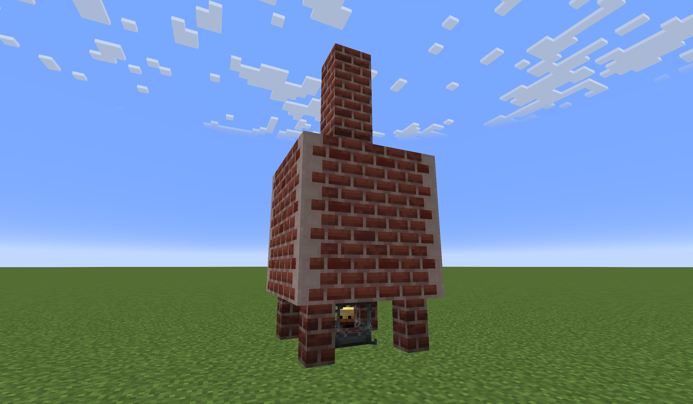
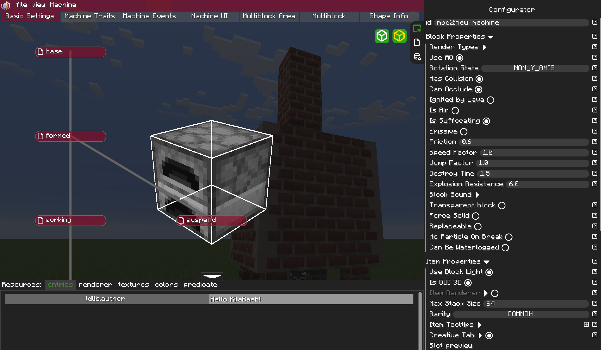
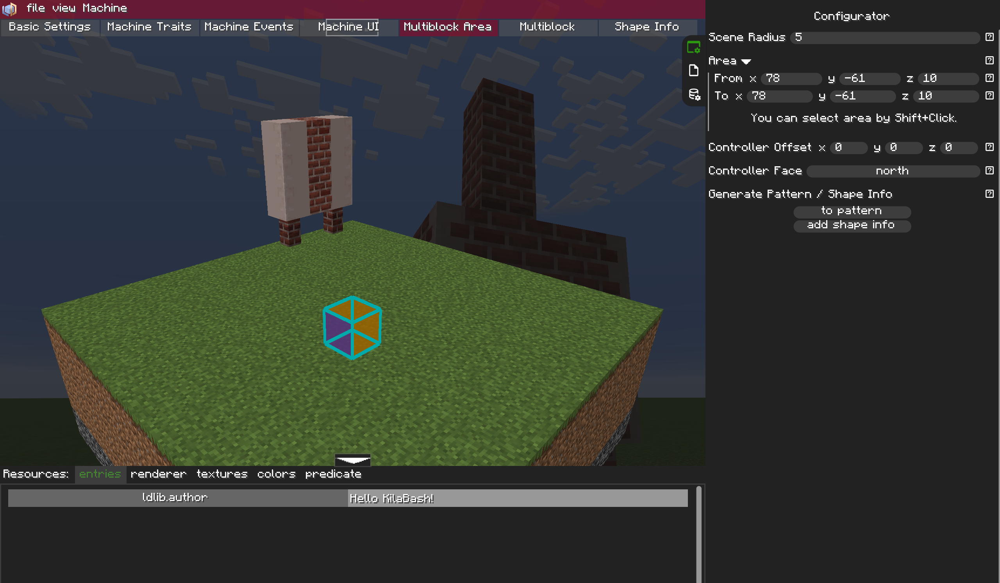
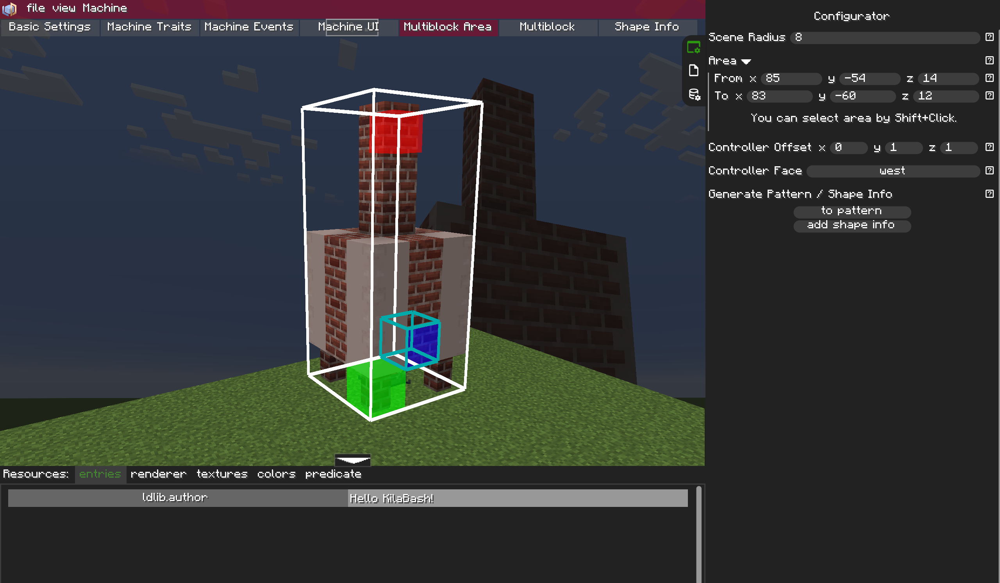
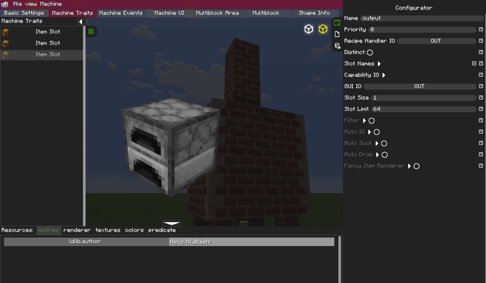
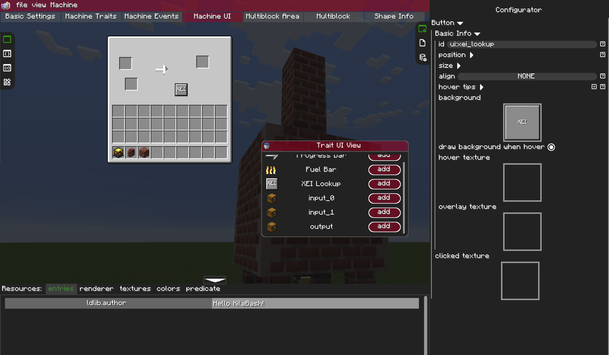
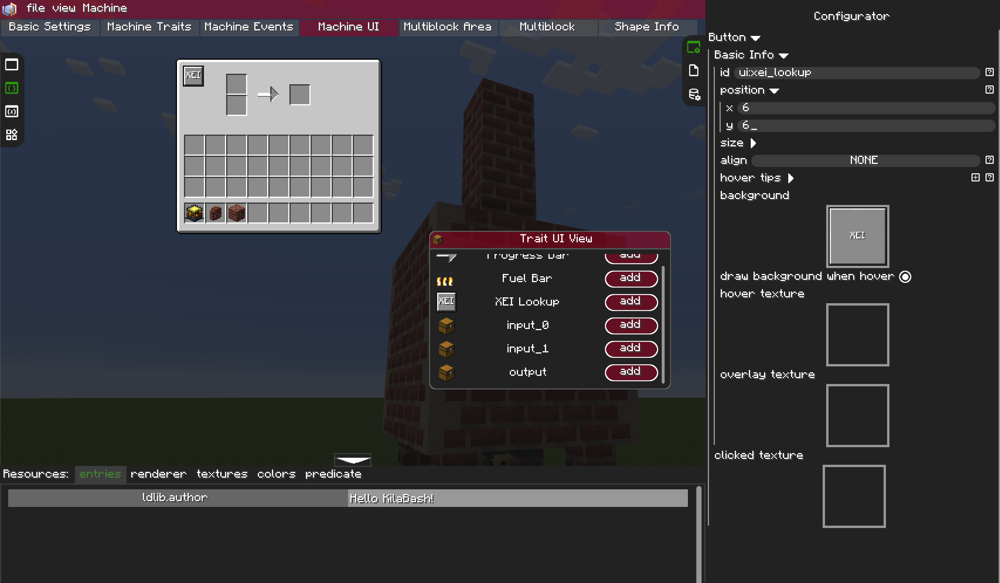
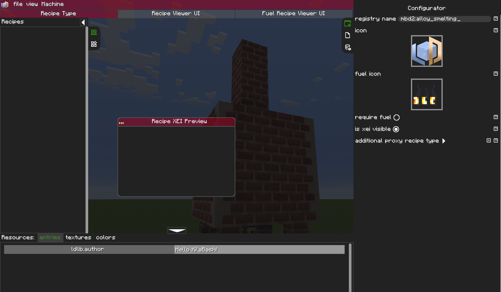
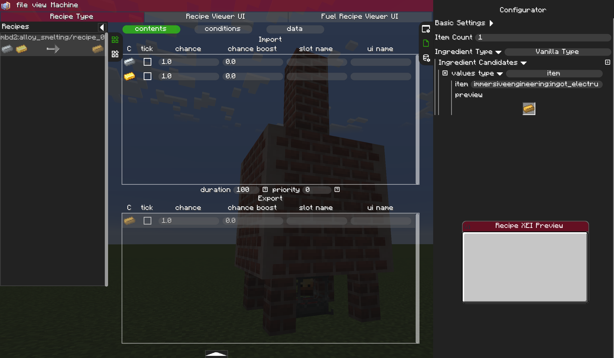
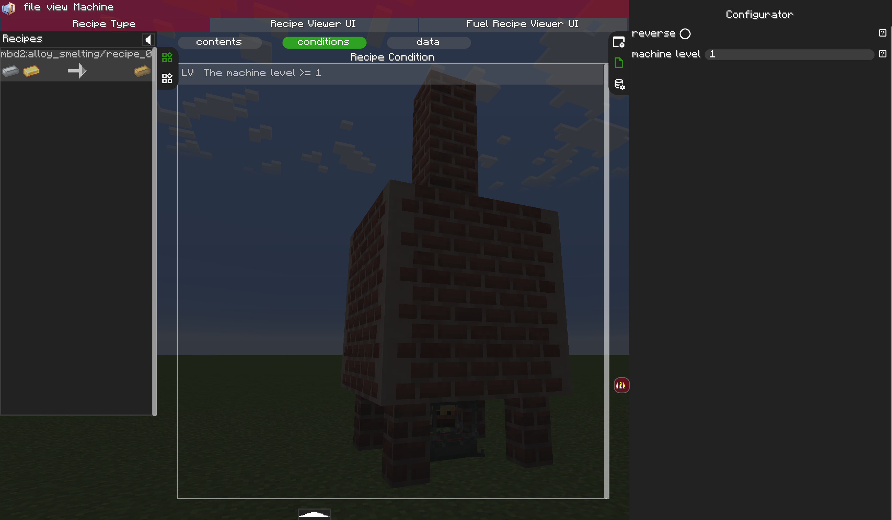

# Tutorial / Blaze Burner alloy furnace
This tutorial will cover making a multiblock alloy furnace, that is powered by a blaze burner. <br>
<br>
A first good step to creating any multiblock machine, is to design a rough structure. This can easily be changed latter, so don't worry about making it perfect.<br>
For this tutorial, put a blaze burner somewhere in the structure, somewhere the player can access it.<br>

Next, we need to make our beautiful structure into a working machine. To do so, run `/mbd2_editor` to open the editor. <br>

### TIP: save your machine frequently, closing the editor does not same, nor retain any unsaved changes.
### TIP: if curios is installed, rebind the 'Open/Close Curios Inventory' to 'Not Bound', by pressing escape while in bind mode, this will prevent pressing 'g' from closing the editor.

Once in the editor, go to `File > New > Multiblock Project` from the menu bar.

First thing you need to change is the `id`, having 2 machines with the same id will cause your game to crash on startup, requiring you to manually remove files (not fun). <br>
For this tutorial, we will name the machine to `mbd2:blaze_alloyer`.<br>
At the bottom of the right panel, scroll all the way down, and turn on `show UI when click structure`. This makes it so you don't have to click on the controller to view the GUI.
Next go to the tab at the top labeled `Multiblock Area`

Note. The block I used for the corners renders bugged in this view, it is not of any concern.<br>
As you can see, the view is centered around the player, and the structure is not in range. Increase the `Sceane Radius` to see more (turning up too high is slow).<br>

### TIP: you can shift left-click on a block in this scene to quickly select the structure.

Use the `Area` sub-fields to select your entire structure.
Change the `Controllor Offset` to change where in the multiblock the controller will be located.<br>
Change the `Controller Face` so that the blue face of the controller is facing out, toward whatever you want to front of your machine to be.<br>

Next press `to pattern`. This make your selection into the structure pattern.<br>
<br>
Next lets move over to `Machine Traits`. This is where you can define the IO of your machine and what systems it interacts with.
For this machine, lets have it take 2 ingredients, and smelt them into 1 output. We will be writing custom interaction with the blaze burner, so there is no trait needed for fuel.
On the left side, right-click and select `Item Slot`. Repeat 3 times, once for each slot.<br>

<br>
Set the id of the first slot to `input_0`.
And set the id of the second slot to `input_1`.
<br>
For the output slot, there is more configuration to do.
First name it to `output` and set `Recipe Handler IO` to `OUT`.
Next set its `GUI IO` to `OUT`. This makes it like a furnace, where you can only take items from the output.
<br>
Now moving on to `Machine UI` tab, we get the design the GUI of the machine.<br>
The `Trait UI View` has buttons to automatically add slots with the correct ids to connect with the machine traits. Use them.

You can move around elements by dragging while holding alt. You can also close the left pane by pressing the arrow, for more screen space.<br>
Now it's time to lay out your slots. Press the add button next to each slot. You may want to move each slot before adding the next to not get them mixed up.<br>
You can also optionally add a Progress Bar, to show recipe progress, and a XEI lookup, to view all the recipes.<br>
<br>
You can lay out your GUI however you like. Here are some examples


<br>
Next we need to make the recipe type.
<br>
Save the machine with `File > Save as`. For the file name, use something like `blaze_alloy_smelter`.
### SAVE YOUR MACHINE FIRST
Go to `File > New > Recipe Type Progect` to create a new recipe type.
Set the id to `mbd2:alloy_smelting`.<br>

Next, to add each recipe, on the left pane, right-click, and select `add recipe (auto id)`. Click on the new recipe entry.<br>
On the `import` pane, right-click, and select `Add content > Item Capability`. Do this twice here, and once in the export pane.<br>
This recipe can be whatever you want it to be, but for the tutorial, we will be recreating Immersive Engineering's Elecrome recipe.<br>
Set the first import item to `immersiveengineering:ingot_silver`.<br>
And the second import item to `minecraft:gold_ingot`.<br>
And set the export item to `immersiveengineering:ingot_electrum`.<br>

Now under `conditions`, right-click in the main pane, and select `add condition > machine level`, 0 will require no heat from the blaze burner, 1 normal heat, and 2 super heated.<br>

<br><br>
[Recipe View UI here]<br><br>
Save your recipe type with `File > Save as` and name it `alloy_smelting`.<br>
<br>
Reopen your machine by going `File > Open` and navigating to `multiblock/blaze_alloy_smelter`. Press Confirm.<br>
Scroll down the `Has Recipe Logic`, and in the sub options, set `Recipe Type` to the recipe type you just created, `mbd:alloy_smelting`.<br>
Also turn on `Always Modify Recipe`.
Now `File > Save`.<br>
<br>
Now it is time for the kubeJS script, for detecting the blaze burner heat level.<br>
Note, this can be done with the builtin event graph, but it lacks some feature that would make it easier. When I get around to contributing those features, I will update this tutorial.<br>
<br>
The kubeJS script goes in `.minecraft/kubejs/server_scripts/src/[name].js` where name is something like `MBDMachineEvents`.<br>
Anywhere in this file (you can have more than one of these per file), you need the following code:<br>
```
MBDMachineEvents.onRecipeWorking("mbd2:blaze_smelter", event => {
    var machine = event.getEvent().getMachine();
    var dir = machine.getPos().offset(multiplyVector(machine.getFrontFacing().get().getNormal(), 0,0,-1)).offset(0,-1,0);
    var heat = machine.getLevel().getBlockEntity(dir).saveWithId().get("fuelLevel");
    machine.setMachineLevel(heat);
});
```
So what does this code do?<br>
line 1: defines a listener to a machine event, in this case, the Recipe working tick event, and runs the following code.<br>
line 2: inits a variable, setting it to the machine that is running this event.<br>
line 3: gets the position of the blaze burner, by getting a pos relative to the machine, and the direction its facing.<br>
line 4: gets the heat level of the blaze burner.<br>
line 5: sets the level on the machine to the heat.<br>
line 6: closing line.<br>
<br>
Note. you may have to change line 3 based on the position of the blaze burner relative to the controller.<br>
You can use the following line `var dir = machine.getPos().offset(multiplyVector(machine.getFrontFacing().get().getNormal(), [a],0,[b])).offset(0,[c],0);`<br>
where:
* -a left
* +a right
* -b back
* +b forward
* -c down
* +c up
  (all when facing the front of the machine. The line in the code example is 1 block back, and 1 block down)