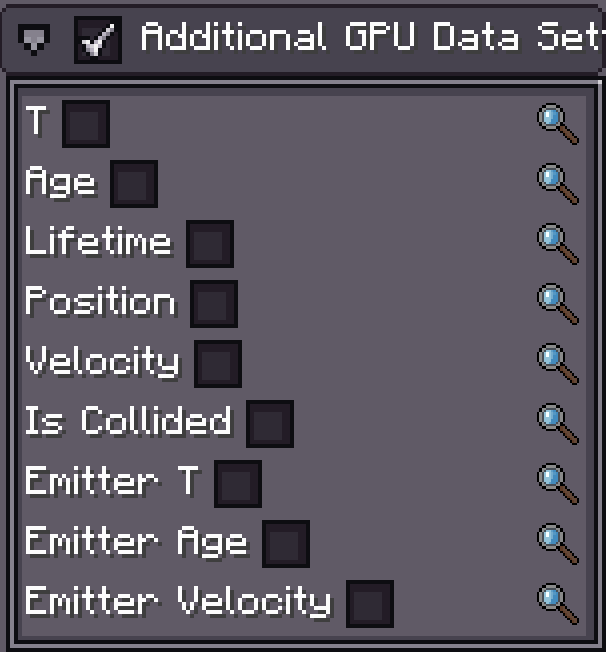

# Additional GPU Data

{{ version_badge("2.0.0", label="Since", icon="tag", href="/changelog/#2.0.0") }}

Photon2 lets you send **extra per-particle vertex attributes** to the GPU — such as `age`, `T`, or velocity.  

> **Note:**  
> - This feature **requires GPU Instance** mode.  
> - Currently supported **only for Particle Emitters** (support for other FX objects will come later).  
> - Modifying vanilla vertex formats is difficult and sending large amounts of per-vertex data is inefficient, hence this separate system.

---

## Particle Emitter

{ width="30%" align=right }

In the `Particle Emitter` **Inspector**, enable **Additional GPU Data** and select the data fields you need.

### Supported Data Types

| Data                  | Type     | Description                         |
| --------------------- | -------- | ----------------------------------- |
| `T`                   | `float`  | **Normalized lifetime**: `age / lifetime` |
| `Age`                 | `float`  | Particle age                        |
| `LifeTime`            | `float`  | Particle lifetime                   |
| `Position (local)`    | `vec3`   | Particle **local position**         |
| `Velocity`            | `vec3`   | Particle velocity                   |
| `isCollided`          | `float`  | `1` = collided, `0` = not yet       |
| `Emitter T`           | `float`  | Emitter normalized lifetime         |
| `Emitter Age`         | `float`  | Emitter age                         |
| `Emitter Position`    | `vec3`   | Emitter world position              |
| `Emitter Velocity`    | `vec3`   | Emitter velocity                    |

---

## 🛠 Shader Setup

Extra attributes are **appended sequentially** after the default vertex layout in the **vertex shader (vsh)**.  

> **⚠ Warning:**  
> - Always place new attribute declarations **after** `#moj_import <photon:particle.glsl>`.  
> - GPU & driver behavior may vary; sequential layouts may not always be reliable — use `layout(location = x)` to explicitly bind attributes when needed.

**Example:** If you enable **`T`** and **`Velocity`**, add them to your shader:

```glsl
#version 330 core

#moj_import <photon:particle.glsl>

in float T;
in vec3 velocity;

/*
layout(location = 9) in float T;       // Explicit location binding
layout(location = 10) in vec3 velocity;
*/

void main() {
    // Use the extra attributes here...
}
```

---

✅ **Pro tip:**  
Keep your **layout indices** organized — mismatches between the emitter’s attribute order and shader declarations can cause rendering glitches or incorrect values.
