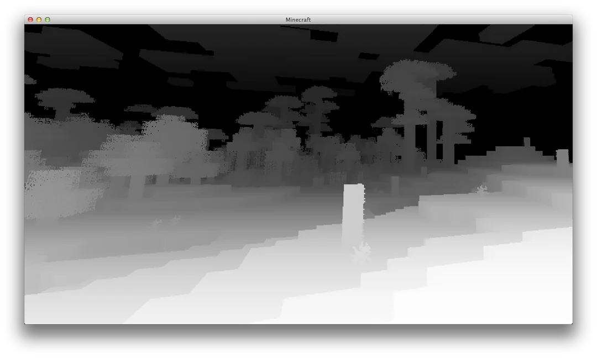
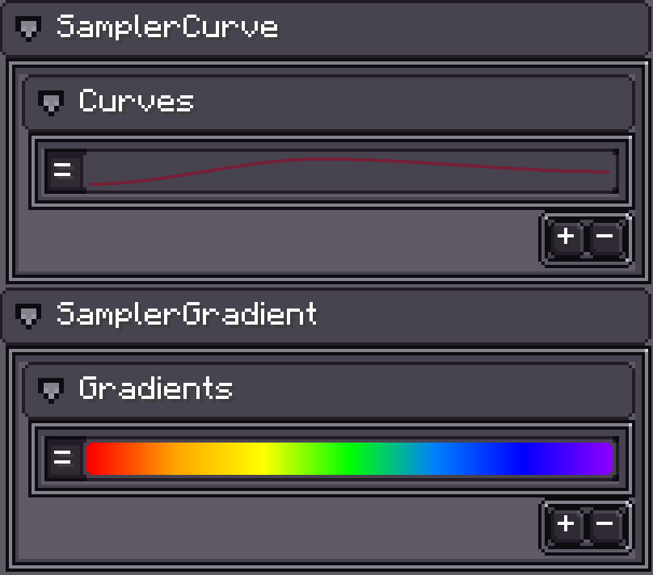

# ExtendedShader

{{ version_badge("2.0.0", label="Since", icon="tag", href="/changelog/#2.0.0") }}

Before reading this page, make sure you understand [Minecraft Core Shader](https://minecraft.wiki/w/Shader#Core_shaders).

Photon2 and LDLib2 extend vanilla shaders with **ExtendedShader**, adding:

- Geometry shader (`attach`) support  
- Extra samplers and uniforms

---

## 📦 How to Use

ExtendedShader JSON is almost the same as Vanilla.  
Here’s an example using `Texture Material`.

=== "hdr_particle.json"

    ```json
    {
        "vertex": "photon:particle",
        /*
            "geometry": "<namespace>:<name>.gsh" // (1)
        */
        "fragment": "photon:hdr_particle",
        "samplers": [
            { "name": "Sampler2" },
            // custom samplers
            { "name": "Texture" }
        ],
        "uniforms": [
            { "name": "ModelViewMat", "type": "matrix4x4", "count": 16, "values": [1,0,0,0,0,1,0,0,0,0,1,0,0,0,0,1] },
            { "name": "ProjMat", "type": "matrix4x4", "count": 16, "values": [1,0,0,0,0,1,0,0,0,0,1,0,0,0,0,1] },
            { "name": "ColorModulator", "type": "float", "count": 4, "values": [1,1,1,1] },
            { "name": "FogStart", "type": "float", "count": 1, "values": [0.0] },
            { "name": "FogEnd", "type": "float", "count": 1, "values": [1.0] },
            { "name": "FogColor", "type": "float", "count": 4, "values": [0,0,0,0] },
            { "name": "FogShape", "type": "int", "count": 1, "values": [0] },
            // custom uniforms
            { "name": "DiscardThreshold", "type": "float", "count": 1, "values": [0.01] },
            { "name": "HDR", "type": "float", "count": 4, "values": [0,0,0,1] },
            { "name": "HDRMode", "type": "int", "count": 1, "values": [0] }
        ]
    }
    ```

    1. Attach geometry shader if needed.

=== "particle.vsh"

    ```glsl
    // have to use 330+
    #version 330 core

    #moj_import <fog.glsl>
    // Photon2 vertex helper
    #moj_import <photon:particle.glsl> 

    uniform sampler2D Sampler2;
    uniform mat4 ModelViewMat;
    uniform mat4 ProjMat;
    uniform int FogShape;

    out float vertexDistance;
    out vec2 texCoord0;
    out vec4 vertexColor;

    void main() {
        ParticleData data = getParticleData();
        gl_Position = ProjMat * ModelViewMat * vec4(data.Position, 1.0);
        vertexDistance = fog_distance(data.Position, FogShape);
        texCoord0 = data.UV;
        vertexColor = data.Color * texelFetch(Sampler2, data.LightUV / 16, 0);
    }
    ```

=== "hdr_particle.fsh"

    ```glsl
    #version 150
    #moj_import <fog.glsl>

    uniform sampler2D Texture;
    uniform vec4 ColorModulator;
    uniform float FogStart;
    uniform float FogEnd;
    uniform vec4 FogColor;
    uniform float DiscardThreshold;
    uniform vec4 HDR;
    uniform int HDRMode;
    uniform float Bits;

    in float vertexDistance;
    in vec2 texCoord0;
    in vec4 vertexColor;

    out vec4 fragColor;

    void main() {
        float bits = max(Bits, 1.0);
        vec2 uv = (floor(texCoord0 * bits) + 0.5) / bits;
        vec4 color = texture(Texture, uv) * vertexColor * ColorModulator;

        if (color.a < DiscardThreshold) discard;

        if (HDRMode == 0) {
            color.rgb += HDR.a * HDR.rgb;
        } else {
            color.rgb *= HDR.a * HDR.rgb;
        }

        fragColor = linear_fog(color, vertexDistance, FogStart, FogEnd, FogColor);
    }
    ```

**Difference from vanilla particle shader:**

- In [`vsh`](#__tabbed_1_2), use `#moj_import <photon:particle.glsl>` and `getParticleData()` to fetch vertex data.
- In [`fsh`](#__tabbed_1_3), added HDR color output.

---

## 🎯 Handle Vertex Data

Different FX objects and renderer settings (e.g., **GPU Instance**, **Additional GPU Data**) can change vertex type and layout.  

Photon2 provides a helper library that, through macros, automatically parses and converts input vertex data into an accessible format.  

More info: [Vertex Format](./VertexFormat.md)

```glsl
// Requires GLSL version 330+
#version 330 core

/*
struct ParticleData {
    vec3 Position;
    vec4 Color;
    vec2 UV;
    ivec2 LightUV;
    vec3 Normal;
};

ParticleData getParticleData() {
    // (1)
}
*/

void main() {
    ParticleData data = getParticleData();
    vec3 position = data.Position;
    vec4 color = data.Color;
    vec2 uv = data.UV;
    ivec2 lightUV = data.LightUV;
    vec3 normal = data.Normal;
}
```

1. Internal Implementation, check [Vertex Format](./VertexFormat.md) for details.

!!! note "Implementation Details"
In vertex shader:

1. Ensure `#version` is 330 or higher.
2. Import Photon2 vertex library: `#moj_import <photon:particle.glsl>`
3. Access data via `getParticleData()` — no need to handle internal layouts manually.
4. Photon2 supports passing extra GPU vertex data (e.g., particle lifetime, velocity).
See: [Additional GPU Data](./AdditionalGPUData.md)

---

## 🎨 Extended Samplers

Photon2 provides **extra built-in samplers** beyond vanilla.
When declared in JSON, these samplers won’t appear in the Inspector.

| Sampler Name        | Description      | Preview                                                |
| ------------------- | ---------------- | ------------------------------------------------------ |
| `Sampler2`          | Light Map        | { width="30%" } |
| `SamplerSceneColor` | World Color      | { width="30%" }  |
| `SamplerSceneDepth` | World Depth      | { width="30%" } |
| `SamplerCurve`      | Curve Sampler    | -                                                      |
| `SamplerGradient`   | Gradient Sampler | -                                                      |

---

### 📈 SamplerCurve / SamplerGradient

{ width="30%" align=right }

Special samplers, active only if a Curve or Gradient is assigned.
Photon2 encodes them into a **128×128 texture** for sampling in shader.

```glsl
#moj_import <photon:particle_utils.glsl>
/* internal implementation
const float INV_TEX_SIZE = 1.0 / 128.0;
const float MAX_U = 1.0 - 0.5 * INV_TEX_SIZE;

float getCurveValue(sampler2D curveTexture, int curveIndex, float x) {
    return texture(curveTexture, vec2(clamp(x, 0.0, MAX_U), (float(curveIndex) + 0.5) * INV_TEX_SIZE)).r;
}

vec4 getGradientValue(sampler2D gradientTexture, int gradientIndex, float x) {
    return texture(gradientTexture, vec2(clamp(x, 0.0, MAX_U), (float(gradientIndex) + 0.5) * INV_TEX_SIZE));
}
*/

uniform sampler2D SamplerCurve;
uniform sampler2D SamplerGradient;

void main() {
    float value = getCurveValue(SamplerCurve, 0, x);
    vec4 color = getGradientValue(SamplerGradient, 0, x);
}
```

Use:

* Import helpers:

  ```glsl
  #moj_import <photon:particle_utils.glsl>
  ```
* Call `getCurveValue()` and `getGradientValue()` to retrieve values.

---

## 🛠 Extended Uniforms

Photon2 adds more **built-in uniforms** on top of vanilla core shaders.

---

### 📋 Vanilla Built-in Uniforms

| Name             | Type  | Description                                                                      |
| ---------------- | ----- | -------------------------------------------------------------------------------- |
| `ModelViewMat`   | mat4  | Model-view matrix                                                                |
| `ProjMat`        | mat4  | Orthographic projection matrix (width=window, height=window, near=0.1, far=1000) |
| `ScreenSize`     | vec2  | Framebuffer width & height (pixels)                                              |
| `ColorModulator` | vec4  | Final color multiplier                                                           |
| `FogColor`       | vec4  | Fog color & density (alpha = density)                                            |
| `FogStart`       | float | Fog start distance                                                               |
| `FogEnd`         | float | Fog end distance                                                                 |
| `FogShape`       | int   | Fog mode                                                                         |
| `GameTime`       | float | Normalized day time (0–1, loops every 20min)                                     |
| `GlintAlpha`     | float | Glint strength (0–1)                                                             |

---

### 📋 Photon2 Built-in Uniforms

| Name                        | Type | Description                        |
| --------------------------- | ---- | ---------------------------------- |
| `U_CameraPosition`          | vec3 | Camera world position              |
| `U_InverseProjectionMatrix` | mat4 | Precomputed inverse `ProjMat`      |
| `U_InverseViewMatrix`       | mat4 | Precomputed inverse `ModelViewMat` |