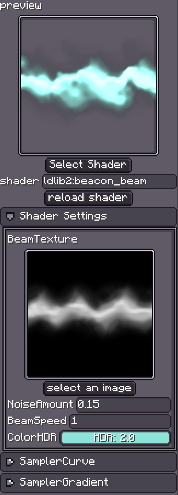

# Preliminary

{{ version_badge("2.0.0", label="Since", icon="tag", href="/changelog/#2.0.0") }}

`Custom Shader Material` lets you **fully control** how rendering is performed.  
Photon2 allows you to write materials using [Minecraft Core Shaders](https://minecraft.wiki/w/Shader#Core_shaders).  

!!! warning
    This wiki **is not** a shader programming tutorial and will not teach Minecraft shader basics.  
    Please refer to the linked resources below for shader knowledge.

---

## 📚 Related Links

!!! info ""
    - [Minecraft Shaders](https://minecraft.wiki/w/Shader#Core_shaders)
    - [Minecraft Shaders (Google Doc)](https://docs.google.com/document/d/15TOAOVLgSNEoHGzpNlkez5cryH3hFF3awXL5Py81EMk/edit#heading=h.56iz1ybwmq8e)
    - [Minecraft Shaders (GitHub Wiki)](https://github.com/ShockMicro/Minecraft-Shaders/wiki/)
    - [Post-processing Shaders](https://minecraft.fandom.com/wiki/Shaders#Post-processing_shaders)
    - [Learn OpenGL](https://learnopengl.com/Introduction)

Photon2 and LDLib2 extend **Vanilla Minecraft Shader** via [ExtendedShader](ExtendedShader.md).  
This extension adds:

- Geometry shader (`attach`) support
- Extra samplers and uniforms

For details, see the **ExtendedShader** page.

---

{ width="30%" align=right }

## How to Use

- Click **`Select Shader`** to choose your shader JSON.  
- Or specify the shader by its **resource location**.
- After modifying your shader, click **`Reload Shader`** to recompile and reload.

!!! note "Shader Path Requirement"
    Minecraft requires **all shader files** (GLSL + JSON) to be placed in:
    ```
    assets/<namespace>/shaders/core/
    ```

---

## Shader Settings

The **Shader Settings** panel displays all **custom** (non-built-in) samplers and uniforms.  
You can edit them directly via the **Inspector**.

---

## Sampler Curve / Sampler Gradient

{ width="30%" align=right }

Photon2 lets you pass a **Curve** or **Gradient** to the shader.  
They are encoded into a **128×128 sampler** so you can sample them in the shader to get values.

For details, see [ExtendedShader](ExtendedShader.md).
