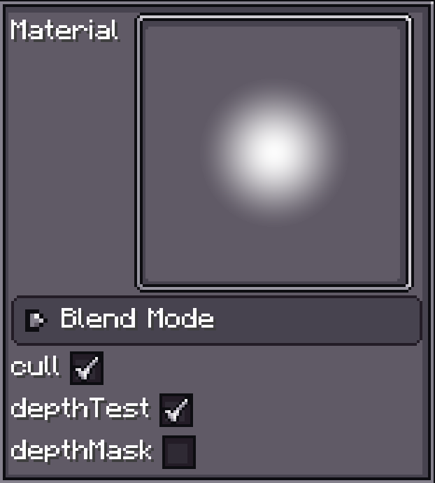
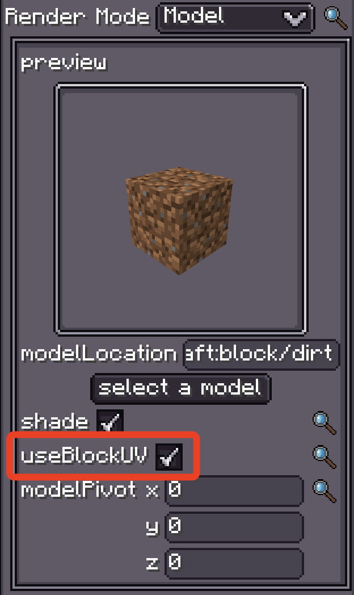

# Introduction

{{ version_badge("2.0.0", label="Since", icon="tag", href="/changelog/#2.0.0") }}

The **Materials system** provides a flexible and extensible framework for handling rendering materials in particle systems.  
It offers various material types with different rendering capabilities, from simple textures to complex custom shaders with HDR support and advanced effects:

- **Texture Material**
- **Sprite Material**
- **[Custom Shader Material](CustomShaderMaterial/index.md)**

---

## Universal Configuration

{ width="30%" align=right }

All materials share the following settings:

| Property       | Type         | Description | Default |
| -------------- | ------------ | ----------- | ------- |
| `material`     | `IMaterial`  | The specific material implementation | Built-in circle texture |
| `blendMode`    | `BlendMode`  | Controls how particles blend with the background | - |
| `cull`         | `boolean`    | Enable/disable face culling | `true` |
| `depthTest`    | `boolean`    | Enable/disable depth testing | `true` |
| `depthMask`    | `boolean`    | Enable/disable depth buffer writing | `false` |

---

=== "Texture Material"
    `Texture Material` is the most common type, designed for texture-based rendering.  
    It supports **custom textures**, **HDR color processing**, **pixel-art mode**, and more.  
    This makes it the most **versatile** material choice in the particle system.

    **Configuration parameters:**

    | Property             | Type              | Description |
    | -------------------- | ----------------- | ----------- |
    | `Texture`            | `ResourceLocation`| Path to the texture file |
    | `Discard Threshold`  | `float`           | Alpha discard threshold |
    | `HDR`                | `Vector4f`        | HDR color vector |
    | `HDR Mode`           | `HDRMode`         | HDR blending mode |
    | `Pixel Art.bits`     | `int`             | Pixel art bit depth |

=== "Sprite Material"
    `Sprite Material` allows you to access **Minecraft’s registered particle textures**.

=== "Custom Shader Material"
    The most **powerful** material type, allowing you to fully control rendering,  
    set **custom samplers/uniforms**, and even **access particle data**.  
    In fact, all material types can be implemented via a custom shader.

    For more info, see [Custom Shader Material](CustomShaderMaterial/index.md).

---

## Special Material: `block_atlas`

!!! info "What is the Block Atlas?"
    See the official wiki: [Block Atlas](https://minecraft.wiki/w/Blocks-atlas#:~:text=blocks%2Datlas%20was%20a%20texture,atlas%20to%20form%20textures%2Datlas%20.)  
    

{ width="30%" align=right }

The built-in `block_atlas` material is essentially a **Texture Material** that lets FX access Minecraft's block atlas texture.

It’s especially useful when rendering particles in **model mode** with `useBlockUV` enabled —  
the UVs can directly access the required block textures from the atlas.  

You can also pass the block atlas as a sampler in a **Custom Shader Material** (see the *sampler* page for details).
